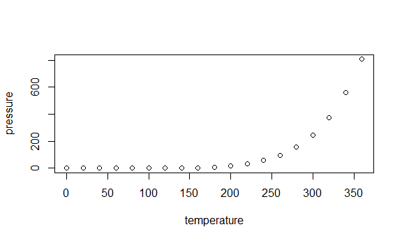

Homework 3
================
Anusorn Thanataveerat
October 3, 2018

true

Problem 1
---------

Make a “spaghetti plot” that shows the number of observations in each state from 2002 to 2010. Make a table showing, for the years 2002, 2006, and 2010, the mean and standard deviation of the proportion of “Excellent” responses across locations in NY State. For each year and state, compute the average proportion in each response category (taking the average across locations in a state). Make a five-panel plot that shows, for each response category separately, the distribution of these state-level averages over time.

``` r
data("brfss_smart2010")
health_overall <-
brfss_smart2010 %>% clean_names() %>%  filter(str_detect(topic, c("Overall Health"))) %>%
# select(-c(
# class:question,
# sample_size,
# confidence_limit_low:geo_location
# )) %>% 
  mutate(response = forcats::fct_relevel(response, 
    c("Excellent", "Very good", "Good", "Fair", "Poor"))) %>% rename(state = locationabbr,
                                                                     county = locationdesc)

# health_overall_wide_fmt <- health_overall %>% spread(response, data_value) %>% rename(Very_Good = `Very good`) %>% 
#   mutate(excellent_Vgood_prop = (Excellent + Very_Good)/(Excellent  + Fair +  Good +  Poor + Very_Good)) %>% 
#   select(year, state = locationabbr, county = locationdesc, Excellent, Very_Good, Good, Fair, Poor, excellent_Vgood_prop)
```

In 2002, which states were observed at 7 locations? **Answer**:

``` r
health_overall %>% filter(year == 2002) %>% distinct(state, county) %>% count(state) %>% 
  filter(n == 7) %>% kable()
```

| state |    n|
|:------|----:|
| CT    |    7|
| FL    |    7|
| NC    |    7|

Including Plots
---------------

You can also embed plots, for example:



Note that the `echo = FALSE` parameter was added to the code chunk to prevent printing of the R code that generated the plot.
