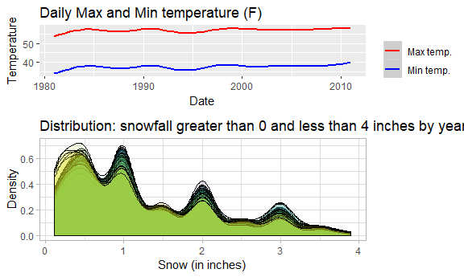

Homework 3
================
Anusorn Thanataveerat
October 3, 2018

true

Problem 1
=========

``` r
data("brfss_smart2010")
health_overall <-
  brfss_smart2010 %>% clean_names() %>%  filter(str_detect(topic, c("Overall Health"))) %>%
  mutate(response = forcats::fct_relevel(response,
  c(
  "Excellent", "Very good", "Good", "Fair", "Poor"
  ))) %>% rename(state = locationabbr,
  county = locationdesc)
```

In 2002, which states were observed at 7 locations?

**Answer**: Florida, Connecticut and North Carolina.

``` r
health_overall %>% filter(year == 2002) %>% distinct(state, county) %>% count(state) %>% 
  filter(n == 7) %>% kable()
```

| state |    n|
|:------|----:|
| CT    |    7|
| FL    |    7|
| NC    |    7|

Make a “spaghetti plot” that shows the number of observations in each state from 2002 to 2010.

``` r
health_overall %>% group_by(year, state) %>% count(state) %>% ggplot(aes(x = year, y = n, group = state)) + geom_line(aes(color = state)) + theme(legend.position = "none") + ylab('Count') + xlab('Year')
```


**Answer**: There are a lot of observations from Florida in 2007 and 2010.

``` r
health_overall %>% group_by(year, state) %>% count(state) %>% ungroup() %>%  top_n(2)
```

    ## Selecting by n

    ## # A tibble: 2 x 3
    ##    year state     n
    ##   <int> <chr> <int>
    ## 1  2007 FL      220
    ## 2  2010 FL      205

Make a table showing, for the years 2002, 2006, and 2010, the mean and standard deviation of the proportion of “Excellent” responses across locations in NY State.

``` r
health_overall %>% filter(year %in% c(2002, 2006, 2010) &
                            state == 'NY' &
                            response == 'Excellent') %>% group_by(year) %>% summarize(mean_excellent = mean(data_value),
                            sd_excellent = sd(data_value)) %>% kable(digits = 1)
```

|  year|  mean\_excellent|  sd\_excellent|
|-----:|----------------:|--------------:|
|  2002|             24.0|            4.5|
|  2006|             22.5|            4.0|
|  2010|             22.7|            3.6|

**Answer**: The average proportion of respondents in New York claiming they are in excellent health is in a decline from year 2002 to 2010.

For each year and state, compute the average proportion in each response category (taking the average across locations in a state).

``` r
health_overall %>% group_by(year, state, response) %>% summarise(mean_proportion = mean(data_value, na.rm = TRUE)) %>% kable(digits = 2)
```

|  year| state | response  |  mean\_proportion|
|-----:|:------|:----------|-----------------:|
|  2002| AK    | Excellent |             27.90|
|  2002| AK    | Very good |             33.70|
|  2002| AK    | Good      |             23.80|
|  2002| AK    | Fair      |              8.60|
|  2002| AK    | Poor      |              5.90|
|  2002| AL    | Excellent |             18.50|
|  2002| AL    | Very good |             30.90|
|  2002| AL    | Good      |             32.70|
|  2002| AL    | Fair      |             12.10|
|  2002| AL    | Poor      |              5.90|
|  2002| AR    | Excellent |             24.10|
|  2002| AR    | Very good |             29.30|
|  2002| AR    | Good      |             29.90|
|  2002| AR    | Fair      |             12.50|
|  2002| AR    | Poor      |              4.20|
|  2002| AZ    | Excellent |             24.10|
|  2002| AZ    | Very good |             33.35|
|  2002| AZ    | Good      |             29.40|
|  2002| AZ    | Fair      |              8.90|
|  2002| AZ    | Poor      |              4.25|
|  2002| CA    | Excellent |             22.70|
|  2002| CA    | Very good |             29.80|
|  2002| CA    | Good      |             28.70|
|  2002| CA    | Fair      |             14.30|
|  2002| CA    | Poor      |              4.50|
|  2002| CO    | Excellent |             23.07|
|  2002| CO    | Very good |             32.52|
|  2002| CO    | Good      |             30.30|
|  2002| CO    | Fair      |             11.22|
|  2002| CO    | Poor      |              2.92|
|  2002| CT    | Excellent |             29.06|
|  2002| CT    | Very good |             33.81|
|  2002| CT    | Good      |             24.97|
|  2002| CT    | Fair      |              8.73|
|  2002| CT    | Poor      |              3.43|
|  2002| DC    | Excellent |             29.30|
|  2002| DC    | Very good |             31.80|
|  2002| DC    | Good      |             28.10|
|  2002| DC    | Fair      |              8.30|
|  2002| DC    | Poor      |              2.40|
|  2002| DE    | Excellent |             20.90|
|  2002| DE    | Very good |             34.20|
|  2002| DE    | Good      |             29.83|
|  2002| DE    | Fair      |             11.07|
|  2002| DE    | Poor      |              4.00|
|  2002| FL    | Excellent |             25.74|
|  2002| FL    | Very good |             31.06|
|  2002| FL    | Good      |             28.94|
|  2002| FL    | Fair      |              9.67|
|  2002| FL    | Poor      |              4.53|
|  2002| GA    | Excellent |             26.93|
|  2002| GA    | Very good |             37.30|
|  2002| GA    | Good      |             26.40|
|  2002| GA    | Fair      |              6.37|
|  2002| GA    | Poor      |              3.00|
|  2002| HI    | Excellent |             19.57|
|  2002| HI    | Very good |             36.80|
|  2002| HI    | Good      |             32.02|
|  2002| HI    | Fair      |              9.00|
|  2002| HI    | Poor      |              2.62|
|  2002| IA    | Excellent |             28.50|
|  2002| IA    | Very good |             34.40|
|  2002| IA    | Good      |             26.80|
|  2002| IA    | Fair      |              7.80|
|  2002| IA    | Poor      |              2.50|
|  2002| ID    | Excellent |             25.15|
|  2002| ID    | Very good |             34.00|
|  2002| ID    | Good      |             28.60|
|  2002| ID    | Fair      |              9.00|
|  2002| ID    | Poor      |              3.25|
|  2002| IL    | Excellent |             23.20|
|  2002| IL    | Very good |             36.37|
|  2002| IL    | Good      |             27.53|
|  2002| IL    | Fair      |             10.03|
|  2002| IL    | Poor      |              2.80|
|  2002| IN    | Excellent |             19.75|
|  2002| IN    | Very good |             30.00|
|  2002| IN    | Good      |             33.40|
|  2002| IN    | Fair      |             12.45|
|  2002| IN    | Poor      |              4.35|
|  2002| KS    | Excellent |             23.10|
|  2002| KS    | Very good |             39.07|
|  2002| KS    | Good      |             27.60|
|  2002| KS    | Fair      |              7.80|
|  2002| KS    | Poor      |              2.43|
|  2002| KY    | Excellent |             19.80|
|  2002| KY    | Very good |             30.50|
|  2002| KY    | Good      |             35.80|
|  2002| KY    | Fair      |              8.50|
|  2002| KY    | Poor      |              5.50|
|  2002| LA    | Excellent |             24.20|
|  2002| LA    | Very good |             30.83|
|  2002| LA    | Good      |             30.23|
|  2002| LA    | Fair      |             10.17|
|  2002| LA    | Poor      |              4.57|
|  2002| MA    | Excellent |             26.61|
|  2002| MA    | Very good |             33.44|
|  2002| MA    | Good      |             25.82|
|  2002| MA    | Fair      |             10.34|
|  2002| MA    | Poor      |              3.80|
|  2002| MD    | Excellent |             26.40|
|  2002| MD    | Very good |             35.73|
|  2002| MD    | Good      |             26.73|
|  2002| MD    | Fair      |              8.65|
|  2002| MD    | Poor      |              2.50|
|  2002| ME    | Excellent |             23.80|
|  2002| ME    | Very good |             40.20|
|  2002| ME    | Good      |             25.05|
|  2002| ME    | Fair      |              9.10|
|  2002| ME    | Poor      |              1.85|
|  2002| MI    | Excellent |             19.93|
|  2002| MI    | Very good |             36.42|
|  2002| MI    | Good      |             30.65|
|  2002| MI    | Fair      |              9.25|
|  2002| MI    | Poor      |              3.73|
|  2002| MN    | Excellent |             24.15|
|  2002| MN    | Very good |             42.58|
|  2002| MN    | Good      |             23.95|
|  2002| MN    | Fair      |              7.00|
|  2002| MN    | Poor      |              2.40|
|  2002| MO    | Excellent |             22.55|
|  2002| MO    | Very good |             32.80|
|  2002| MO    | Good      |             29.15|
|  2002| MO    | Fair      |             11.60|
|  2002| MO    | Poor      |              3.90|
|  2002| MS    | Excellent |             20.00|
|  2002| MS    | Very good |             28.80|
|  2002| MS    | Good      |             32.40|
|  2002| MS    | Fair      |             12.30|
|  2002| MS    | Poor      |              6.70|
|  2002| NC    | Excellent |             23.56|
|  2002| NC    | Very good |             34.30|
|  2002| NC    | Good      |             26.74|
|  2002| NC    | Fair      |             11.11|
|  2002| NC    | Poor      |              4.29|
|  2002| ND    | Excellent |             20.40|
|  2002| ND    | Very good |             42.10|
|  2002| ND    | Good      |             27.60|
|  2002| ND    | Fair      |              6.60|
|  2002| ND    | Poor      |              3.30|
|  2002| NE    | Excellent |             27.17|
|  2002| NE    | Very good |             36.50|
|  2002| NE    | Good      |             26.50|
|  2002| NE    | Fair      |              7.57|
|  2002| NE    | Poor      |              2.27|
|  2002| NH    | Excellent |             27.36|
|  2002| NH    | Very good |             37.22|
|  2002| NH    | Good      |             23.66|
|  2002| NH    | Fair      |              8.98|
|  2002| NH    | Poor      |              2.76|
|  2002| NJ    | Excellent |             24.82|
|  2002| NJ    | Very good |             31.27|
|  2002| NJ    | Good      |             30.25|
|  2002| NJ    | Fair      |             10.53|
|  2002| NJ    | Poor      |              3.12|
|  2002| NM    | Excellent |             23.40|
|  2002| NM    | Very good |             34.20|
|  2002| NM    | Good      |             27.60|
|  2002| NM    | Fair      |             11.20|
|  2002| NM    | Poor      |              3.60|
|  2002| NV    | Excellent |             19.85|
|  2002| NV    | Very good |             32.40|
|  2002| NV    | Good      |             31.65|
|  2002| NV    | Fair      |             12.55|
|  2002| NV    | Poor      |              3.50|
|  2002| NY    | Excellent |             24.04|
|  2002| NY    | Very good |             30.64|
|  2002| NY    | Good      |             29.58|
|  2002| NY    | Fair      |             11.62|
|  2002| NY    | Poor      |              4.08|
|  2002| OH    | Excellent |             19.23|
|  2002| OH    | Very good |             34.38|
|  2002| OH    | Good      |             31.02|
|  2002| OH    | Fair      |             11.55|
|  2002| OH    | Poor      |              3.83|
|  2002| OK    | Excellent |             22.43|
|  2002| OK    | Very good |             35.00|
|  2002| OK    | Good      |             28.27|
|  2002| OK    | Fair      |              9.77|
|  2002| OK    | Poor      |              4.57|
|  2002| OR    | Excellent |             21.30|
|  2002| OR    | Very good |             36.00|
|  2002| OR    | Good      |             29.57|
|  2002| OR    | Fair      |             10.57|
|  2002| OR    | Poor      |              2.60|
|  2002| PA    | Excellent |             22.45|
|  2002| PA    | Very good |             34.54|
|  2002| PA    | Good      |             29.58|
|  2002| PA    | Fair      |             10.04|
|  2002| PA    | Poor      |              3.41|
|  2002| RI    | Excellent |             25.15|
|  2002| RI    | Very good |             34.58|
|  2002| RI    | Good      |             28.00|
|  2002| RI    | Fair      |              9.50|
|  2002| RI    | Poor      |              2.77|
|  2002| SC    | Excellent |             19.60|
|  2002| SC    | Very good |             27.70|
|  2002| SC    | Good      |             32.53|
|  2002| SC    | Fair      |             14.63|
|  2002| SC    | Poor      |              5.50|
|  2002| SD    | Excellent |             23.45|
|  2002| SD    | Very good |             35.90|
|  2002| SD    | Good      |             29.25|
|  2002| SD    | Fair      |              8.30|
|  2002| SD    | Poor      |              3.10|
|  2002| TN    | Excellent |             20.55|
|  2002| TN    | Very good |             29.80|
|  2002| TN    | Good      |             33.70|
|  2002| TN    | Fair      |             11.30|
|  2002| TN    | Poor      |              4.75|
|  2002| TX    | Excellent |             19.25|
|  2002| TX    | Very good |             26.15|
|  2002| TX    | Good      |             34.15|
|  2002| TX    | Fair      |             16.30|
|  2002| TX    | Poor      |              4.15|
|  2002| UT    | Excellent |             29.46|
|  2002| UT    | Very good |             33.22|
|  2002| UT    | Good      |             28.04|
|  2002| UT    | Fair      |              6.78|
|  2002| UT    | Poor      |              2.50|
|  2002| VT    | Excellent |             27.87|
|  2002| VT    | Very good |             35.77|
|  2002| VT    | Good      |             25.93|
|  2002| VT    | Fair      |              7.87|
|  2002| VT    | Poor      |              2.60|
|  2002| WA    | Excellent |             21.73|
|  2002| WA    | Very good |             35.92|
|  2002| WA    | Good      |             30.85|
|  2002| WA    | Fair      |              8.90|
|  2002| WA    | Poor      |              2.57|
|  2002| WI    | Excellent |             21.10|
|  2002| WI    | Very good |             30.10|
|  2002| WI    | Good      |             32.70|
|  2002| WI    | Fair      |             12.90|
|  2002| WI    | Poor      |              3.30|
|  2002| WV    | Excellent |             16.50|
|  2002| WV    | Very good |             32.40|
|  2002| WV    | Good      |             33.40|
|  2002| WV    | Fair      |              9.50|
|  2002| WV    | Poor      |              8.30|
|  2002| WY    | Excellent |             25.50|
|  2002| WY    | Very good |             35.90|
|  2002| WY    | Good      |             25.80|
|  2002| WY    | Fair      |              8.70|
|  2002| WY    | Poor      |              4.00|
|  2003| AK    | Excellent |             24.85|
|  2003| AK    | Very good |             34.85|
|  2003| AK    | Good      |             30.60|
|  2003| AK    | Fair      |              6.75|
|  2003| AK    | Poor      |              2.95|
|  2003| AL    | Excellent |             19.50|
|  2003| AL    | Very good |             33.40|
|  2003| AL    | Good      |             30.60|
|  2003| AL    | Fair      |             12.80|
|  2003| AL    | Poor      |              3.70|
|  2003| AR    | Excellent |             24.30|
|  2003| AR    | Very good |             32.40|
|  2003| AR    | Good      |             30.40|
|  2003| AR    | Fair      |             10.10|
|  2003| AR    | Poor      |              2.70|
|  2003| AZ    | Excellent |             26.30|
|  2003| AZ    | Very good |             33.15|
|  2003| AZ    | Good      |             26.85|
|  2003| AZ    | Fair      |             10.55|
|  2003| AZ    | Poor      |              3.05|
|  2003| CA    | Excellent |             22.00|
|  2003| CA    | Very good |             31.00|
|  2003| CA    | Good      |             29.30|
|  2003| CA    | Fair      |             12.90|
|  2003| CA    | Poor      |              4.80|
|  2003| CO    | Excellent |             23.32|
|  2003| CO    | Very good |             35.45|
|  2003| CO    | Good      |             25.95|
|  2003| CO    | Fair      |             12.12|
|  2003| CO    | Poor      |              3.15|
|  2003| CT    | Excellent |             29.18|
|  2003| CT    | Very good |             34.72|
|  2003| CT    | Good      |             24.38|
|  2003| CT    | Fair      |              9.32|
|  2003| CT    | Poor      |              2.46|
|  2003| DC    | Excellent |             27.30|
|  2003| DC    | Very good |             35.50|
|  2003| DC    | Good      |             24.70|
|  2003| DC    | Fair      |              9.00|
|  2003| DC    | Poor      |              3.40|
|  2003| DE    | Excellent |             21.53|
|  2003| DE    | Very good |             34.67|
|  2003| DE    | Good      |             28.83|
|  2003| DE    | Fair      |             11.37|
|  2003| DE    | Poor      |              3.63|
|  2003| GA    | Excellent |             22.03|
|  2003| GA    | Very good |             35.43|
|  2003| GA    | Good      |             28.37|
|  2003| GA    | Fair      |              9.40|
|  2003| GA    | Poor      |              4.80|
|  2003| HI    | Excellent |             23.50|
|  2003| HI    | Very good |             31.93|
|  2003| HI    | Good      |             32.40|
|  2003| HI    | Fair      |             10.13|
|  2003| HI    | Poor      |              2.00|
|  2003| IA    | Excellent |             21.50|
|  2003| IA    | Very good |             39.70|
|  2003| IA    | Good      |             30.10|
|  2003| IA    | Fair      |              5.40|
|  2003| IA    | Poor      |              3.40|
|  2003| ID    | Excellent |             25.90|
|  2003| ID    | Very good |             37.90|
|  2003| ID    | Good      |             24.45|
|  2003| ID    | Fair      |              8.80|
|  2003| ID    | Poor      |              3.00|
|  2003| IL    | Excellent |             23.47|
|  2003| IL    | Very good |             32.63|
|  2003| IL    | Good      |             31.27|
|  2003| IL    | Fair      |              9.80|
|  2003| IL    | Poor      |              2.83|
|  2003| IN    | Excellent |             18.50|
|  2003| IN    | Very good |             30.65|
|  2003| IN    | Good      |             32.75|
|  2003| IN    | Fair      |             14.00|
|  2003| IN    | Poor      |              4.10|
|  2003| KS    | Excellent |             23.33|
|  2003| KS    | Very good |             39.60|
|  2003| KS    | Good      |             26.23|
|  2003| KS    | Fair      |              7.83|
|  2003| KS    | Poor      |              2.93|
|  2003| KY    | Excellent |             23.50|
|  2003| KY    | Very good |             27.90|
|  2003| KY    | Good      |             32.60|
|  2003| KY    | Fair      |             11.60|
|  2003| KY    | Poor      |              4.50|
|  2003| LA    | Excellent |             22.68|
|  2003| LA    | Very good |             32.30|
|  2003| LA    | Good      |             29.70|
|  2003| LA    | Fair      |             11.68|
|  2003| LA    | Poor      |              3.68|
|  2003| MA    | Excellent |             25.34|
|  2003| MA    | Very good |             33.66|
|  2003| MA    | Good      |             28.21|
|  2003| MA    | Fair      |              9.60|
|  2003| MA    | Poor      |              3.21|
|  2003| MD    | Excellent |             24.65|
|  2003| MD    | Very good |             34.43|
|  2003| MD    | Good      |             29.00|
|  2003| MD    | Fair      |              8.68|
|  2003| MD    | Poor      |              3.27|
|  2003| ME    | Excellent |             24.45|
|  2003| ME    | Very good |             39.50|
|  2003| ME    | Good      |             26.25|
|  2003| ME    | Fair      |              7.75|
|  2003| ME    | Poor      |              2.10|
|  2003| MI    | Excellent |             19.40|
|  2003| MI    | Very good |             34.95|
|  2003| MI    | Good      |             31.95|
|  2003| MI    | Fair      |              9.55|
|  2003| MI    | Poor      |              4.15|
|  2003| MN    | Excellent |             24.17|
|  2003| MN    | Very good |             41.80|
|  2003| MN    | Good      |             23.30|
|  2003| MN    | Fair      |              9.03|
|  2003| MN    | Poor      |              1.73|
|  2003| MO    | Excellent |             19.05|
|  2003| MO    | Very good |             35.95|
|  2003| MO    | Good      |             31.45|
|  2003| MO    | Fair      |              9.75|
|  2003| MO    | Poor      |              3.85|
|  2003| MS    | Excellent |             23.40|
|  2003| MS    | Very good |             32.20|
|  2003| MS    | Good      |             28.80|
|  2003| MS    | Fair      |             10.90|
|  2003| MS    | Poor      |              4.60|
|  2003| NC    | Excellent |             25.24|
|  2003| NC    | Very good |             32.58|
|  2003| NC    | Good      |             26.66|
|  2003| NC    | Fair      |             12.10|
|  2003| NC    | Poor      |              3.46|
|  2003| ND    | Excellent |             24.80|
|  2003| ND    | Very good |             42.70|
|  2003| ND    | Good      |             24.10|
|  2003| ND    | Fair      |              4.90|
|  2003| ND    | Poor      |              3.40|
|  2003| NE    | Excellent |             26.13|
|  2003| NE    | Very good |             38.53|
|  2003| NE    | Good      |             25.07|
|  2003| NE    | Fair      |              7.57|
|  2003| NE    | Poor      |              2.70|
|  2003| NH    | Excellent |             28.08|
|  2003| NH    | Very good |             37.18|
|  2003| NH    | Good      |             24.08|
|  2003| NH    | Fair      |              7.60|
|  2003| NH    | Poor      |              3.06|
|  2003| NJ    | Excellent |             23.64|
|  2003| NJ    | Very good |             33.86|
|  2003| NJ    | Good      |             28.12|
|  2003| NJ    | Fair      |             10.64|
|  2003| NJ    | Poor      |              3.76|
|  2003| NM    | Excellent |             21.17|
|  2003| NM    | Very good |             29.20|
|  2003| NM    | Good      |             33.93|
|  2003| NM    | Fair      |             11.27|
|  2003| NM    | Poor      |              4.43|
|  2003| NV    | Excellent |             22.75|
|  2003| NV    | Very good |             31.65|
|  2003| NV    | Good      |             30.30|
|  2003| NV    | Fair      |             12.50|
|  2003| NV    | Poor      |              2.85|
|  2003| NY    | Excellent |             21.92|
|  2003| NY    | Very good |             32.33|
|  2003| NY    | Good      |             29.52|
|  2003| NY    | Fair      |             12.63|
|  2003| NY    | Poor      |              3.60|
|  2003| OH    | Excellent |             20.82|
|  2003| OH    | Very good |             34.00|
|  2003| OH    | Good      |             29.80|
|  2003| OH    | Fair      |             11.38|
|  2003| OH    | Poor      |              4.03|
|  2003| OK    | Excellent |             23.60|
|  2003| OK    | Very good |             31.53|
|  2003| OK    | Good      |             31.07|
|  2003| OK    | Fair      |             10.33|
|  2003| OK    | Poor      |              3.50|
|  2003| OR    | Excellent |             24.20|
|  2003| OR    | Very good |             34.70|
|  2003| OR    | Good      |             28.00|
|  2003| OR    | Fair      |              9.43|
|  2003| OR    | Poor      |              3.67|
|  2003| PA    | Excellent |             20.30|
|  2003| PA    | Very good |             34.50|
|  2003| PA    | Good      |             28.90|
|  2003| PA    | Fair      |             13.05|
|  2003| PA    | Poor      |              3.25|
|  2003| RI    | Excellent |             26.65|
|  2003| RI    | Very good |             35.35|
|  2003| RI    | Good      |             25.80|
|  2003| RI    | Fair      |              8.65|
|  2003| RI    | Poor      |              3.60|
|  2003| SC    | Excellent |             27.10|
|  2003| SC    | Very good |             33.10|
|  2003| SC    | Good      |             28.58|
|  2003| SC    | Fair      |              7.52|
|  2003| SC    | Poor      |              3.72|
|  2003| SD    | Excellent |             22.65|
|  2003| SD    | Very good |             39.80|
|  2003| SD    | Good      |             26.80|
|  2003| SD    | Fair      |              8.05|
|  2003| SD    | Poor      |              2.70|
|  2003| TN    | Excellent |             23.80|
|  2003| TN    | Very good |             33.10|
|  2003| TN    | Good      |             31.70|
|  2003| TN    | Fair      |              6.70|
|  2003| TN    | Poor      |              4.70|
|  2003| TX    | Excellent |             20.45|
|  2003| TX    | Very good |             26.00|
|  2003| TX    | Good      |             33.85|
|  2003| TX    | Fair      |             14.45|
|  2003| TX    | Poor      |              5.30|
|  2003| UT    | Excellent |             28.10|
|  2003| UT    | Very good |             35.70|
|  2003| UT    | Good      |             26.15|
|  2003| UT    | Fair      |              7.90|
|  2003| UT    | Poor      |              2.17|
|  2003| VT    | Excellent |             25.97|
|  2003| VT    | Very good |             37.70|
|  2003| VT    | Good      |             26.33|
|  2003| VT    | Fair      |              7.57|
|  2003| VT    | Poor      |              2.43|
|  2003| WA    | Excellent |             20.43|
|  2003| WA    | Very good |             35.11|
|  2003| WA    | Good      |             30.13|
|  2003| WA    | Fair      |             10.48|
|  2003| WA    | Poor      |              3.88|
|  2003| WI    | Excellent |             22.40|
|  2003| WI    | Very good |             35.20|
|  2003| WI    | Good      |             26.70|
|  2003| WI    | Fair      |             12.50|
|  2003| WI    | Poor      |              3.20|
|  2003| WV    | Excellent |             18.20|
|  2003| WV    | Very good |             35.40|
|  2003| WV    | Good      |             28.00|
|  2003| WV    | Fair      |             12.00|
|  2003| WV    | Poor      |              6.40|
|  2003| WY    | Excellent |             22.20|
|  2003| WY    | Very good |             37.45|
|  2003| WY    | Good      |             29.40|
|  2003| WY    | Fair      |              7.85|
|  2003| WY    | Poor      |              3.15|
|  2004| AK    | Excellent |             23.05|
|  2004| AK    | Very good |             36.80|
|  2004| AK    | Good      |             29.60|
|  2004| AK    | Fair      |              7.00|
|  2004| AK    | Poor      |              3.25|
|  2004| AL    | Excellent |             20.00|
|  2004| AL    | Very good |             30.10|
|  2004| AL    | Good      |             33.00|
|  2004| AL    | Fair      |             11.20|
|  2004| AL    | Poor      |              5.30|
|  2004| AR    | Excellent |             21.00|
|  2004| AR    | Very good |             34.50|
|  2004| AR    | Good      |             31.20|
|  2004| AR    | Fair      |              9.70|
|  2004| AR    | Poor      |              3.20|
|  2004| AZ    | Excellent |             22.32|
|  2004| AZ    | Very good |             31.45|
|  2004| AZ    | Good      |             30.00|
|  2004| AZ    | Fair      |             11.20|
|  2004| AZ    | Poor      |              4.62|
|  2004| CA    | Excellent |             18.10|
|  2004| CA    | Very good |             34.00|
|  2004| CA    | Good      |             29.00|
|  2004| CA    | Fair      |             15.00|
|  2004| CA    | Poor      |              3.50|
|  2004| CO    | Excellent |             23.37|
|  2004| CO    | Very good |             34.38|
|  2004| CO    | Good      |             30.68|
|  2004| CO    | Fair      |              8.62|
|  2004| CO    | Poor      |              2.55|
|  2004| CT    | Excellent |             26.27|
|  2004| CT    | Very good |             35.60|
|  2004| CT    | Good      |             27.27|
|  2004| CT    | Fair      |              7.93|
|  2004| CT    | Poor      |              2.52|
|  2004| DC    | Excellent |             28.80|
|  2004| DC    | Very good |             34.00|
|  2004| DC    | Good      |             25.80|
|  2004| DC    | Fair      |              7.50|
|  2004| DC    | Poor      |              3.30|
|  2004| DE    | Excellent |             19.43|
|  2004| DE    | Very good |             36.37|
|  2004| DE    | Good      |             30.20|
|  2004| DE    | Fair      |             10.07|
|  2004| DE    | Poor      |              3.60|
|  2004| FL    | Excellent |             21.72|
|  2004| FL    | Very good |             30.74|
|  2004| FL    | Good      |             30.84|
|  2004| FL    | Fair      |             11.66|
|  2004| FL    | Poor      |              4.64|
|  2004| IA    | Excellent |             22.00|
|  2004| IA    | Very good |             39.10|
|  2004| IA    | Good      |             27.00|
|  2004| IA    | Fair      |              9.70|
|  2004| IA    | Poor      |              1.80|
|  2004| ID    | Excellent |             21.20|
|  2004| ID    | Very good |             36.53|
|  2004| ID    | Good      |             27.37|
|  2004| ID    | Fair      |              9.63|
|  2004| ID    | Poor      |              4.97|
|  2004| IL    | Excellent |             24.40|
|  2004| IL    | Very good |             34.85|
|  2004| IL    | Good      |             27.25|
|  2004| IL    | Fair      |              9.80|
|  2004| IL    | Poor      |              3.50|
|  2004| IN    | Excellent |             18.85|
|  2004| IN    | Very good |             29.50|
|  2004| IN    | Good      |             32.15|
|  2004| IN    | Fair      |             14.80|
|  2004| IN    | Poor      |              4.30|
|  2004| KS    | Excellent |             19.52|
|  2004| KS    | Very good |             38.80|
|  2004| KS    | Good      |             28.18|
|  2004| KS    | Fair      |              9.47|
|  2004| KS    | Poor      |              3.70|
|  2004| KY    | Excellent |             21.00|
|  2004| KY    | Very good |             35.10|
|  2004| KY    | Good      |             27.50|
|  2004| KY    | Fair      |             12.20|
|  2004| KY    | Poor      |              4.00|
|  2004| LA    | Excellent |             20.66|
|  2004| LA    | Very good |             31.64|
|  2004| LA    | Good      |             29.49|
|  2004| LA    | Fair      |             12.57|
|  2004| LA    | Poor      |              5.27|
|  2004| MA    | Excellent |             25.59|
|  2004| MA    | Very good |             35.56|
|  2004| MA    | Good      |             25.94|
|  2004| MA    | Fair      |              9.36|
|  2004| MA    | Poor      |              3.14|
|  2004| MD    | Excellent |             25.13|
|  2004| MD    | Very good |             34.95|
|  2004| MD    | Good      |             27.83|
|  2004| MD    | Fair      |              8.35|
|  2004| MD    | Poor      |              3.43|
|  2004| ME    | Excellent |             23.75|
|  2004| ME    | Very good |             36.90|
|  2004| ME    | Good      |             25.75|
|  2004| ME    | Fair      |              9.40|
|  2004| ME    | Poor      |              3.80|
|  2004| MI    | Excellent |             20.07|
|  2004| MI    | Very good |             31.00|
|  2004| MI    | Good      |             34.00|
|  2004| MI    | Fair      |             10.87|
|  2004| MI    | Poor      |              3.70|
|  2004| MN    | Excellent |             23.52|
|  2004| MN    | Very good |             37.35|
|  2004| MN    | Good      |             29.57|
|  2004| MN    | Fair      |              7.15|
|  2004| MN    | Poor      |              2.02|
|  2004| MO    | Excellent |             20.57|
|  2004| MO    | Very good |             34.13|
|  2004| MO    | Good      |             29.87|
|  2004| MO    | Fair      |              9.90|
|  2004| MO    | Poor      |              5.07|
|  2004| MS    | Excellent |             20.30|
|  2004| MS    | Very good |             32.00|
|  2004| MS    | Good      |             29.30|
|  2004| MS    | Fair      |             13.00|
|  2004| MS    | Poor      |              5.00|
|  2004| MT    | Excellent |             20.10|
|  2004| MT    | Very good |             34.70|
|  2004| MT    | Good      |             33.00|
|  2004| MT    | Fair      |              7.50|
|  2004| MT    | Poor      |              4.50|
|  2004| NC    | Excellent |             22.77|
|  2004| NC    | Very good |             32.12|
|  2004| NC    | Good      |             28.93|
|  2004| NC    | Fair      |             11.47|
|  2004| NC    | Poor      |              4.37|
|  2004| ND    | Excellent |             23.80|
|  2004| ND    | Very good |             38.50|
|  2004| ND    | Good      |             31.00|
|  2004| ND    | Fair      |              4.00|
|  2004| ND    | Poor      |              2.20|
|  2004| NE    | Excellent |             22.77|
|  2004| NE    | Very good |             37.25|
|  2004| NE    | Good      |             28.00|
|  2004| NE    | Fair      |              8.30|
|  2004| NE    | Poor      |              3.30|
|  2004| NH    | Excellent |             27.38|
|  2004| NH    | Very good |             36.18|
|  2004| NH    | Good      |             25.56|
|  2004| NH    | Fair      |              7.34|
|  2004| NH    | Poor      |              3.18|
|  2004| NJ    | Excellent |             22.95|
|  2004| NJ    | Very good |             32.31|
|  2004| NJ    | Good      |             29.59|
|  2004| NJ    | Fair      |             11.34|
|  2004| NJ    | Poor      |              3.32|
|  2004| NM    | Excellent |             21.48|
|  2004| NM    | Very good |             30.70|
|  2004| NM    | Good      |             31.13|
|  2004| NM    | Fair      |             11.63|
|  2004| NM    | Poor      |              4.65|
|  2004| NV    | Excellent |             20.90|
|  2004| NV    | Very good |             32.20|
|  2004| NV    | Good      |             28.90|
|  2004| NV    | Fair      |             14.05|
|  2004| NV    | Poor      |              3.60|
|  2004| NY    | Excellent |             21.24|
|  2004| NY    | Very good |             28.70|
|  2004| NY    | Good      |             31.86|
|  2004| NY    | Fair      |             13.30|
|  2004| NY    | Poor      |              4.54|
|  2004| OH    | Excellent |             21.05|
|  2004| OH    | Very good |             35.58|
|  2004| OH    | Good      |             29.10|
|  2004| OH    | Fair      |             10.36|
|  2004| OH    | Poor      |              3.51|
|  2004| OK    | Excellent |             20.97|
|  2004| OK    | Very good |             35.13|
|  2004| OK    | Good      |             29.10|
|  2004| OK    | Fair      |             10.03|
|  2004| OK    | Poor      |              4.33|
|  2004| OR    | Excellent |             22.10|
|  2004| OR    | Very good |             33.83|
|  2004| OR    | Good      |             31.57|
|  2004| OR    | Fair      |              8.90|
|  2004| OR    | Poor      |              3.30|
|  2004| PA    | Excellent |             20.93|
|  2004| PA    | Very good |             33.67|
|  2004| PA    | Good      |             29.60|
|  2004| PA    | Fair      |             12.00|
|  2004| PA    | Poor      |              3.43|
|  2004| RI    | Excellent |             24.02|
|  2004| RI    | Very good |             34.17|
|  2004| RI    | Good      |             27.73|
|  2004| RI    | Fair      |             10.22|
|  2004| RI    | Poor      |              3.42|
|  2004| SC    | Excellent |             21.45|
|  2004| SC    | Very good |             34.02|
|  2004| SC    | Good      |             30.42|
|  2004| SC    | Fair      |              9.88|
|  2004| SC    | Poor      |              3.75|
|  2004| SD    | Excellent |             24.85|
|  2004| SD    | Very good |             38.60|
|  2004| SD    | Good      |             25.30|
|  2004| SD    | Fair      |              8.50|
|  2004| SD    | Poor      |              2.45|
|  2004| TN    | Excellent |             19.02|
|  2004| TN    | Very good |             31.12|
|  2004| TN    | Good      |             31.38|
|  2004| TN    | Fair      |             11.25|
|  2004| TN    | Poor      |              6.88|
|  2004| TX    | Excellent |             19.03|
|  2004| TX    | Very good |             27.85|
|  2004| TX    | Good      |             32.23|
|  2004| TX    | Fair      |             16.30|
|  2004| TX    | Poor      |              4.15|
|  2004| UT    | Excellent |             25.50|
|  2004| UT    | Very good |             35.60|
|  2004| UT    | Good      |             27.15|
|  2004| UT    | Fair      |              8.83|
|  2004| UT    | Poor      |              2.48|
|  2004| VT    | Excellent |             23.75|
|  2004| VT    | Very good |             37.23|
|  2004| VT    | Good      |             26.30|
|  2004| VT    | Fair      |              9.50|
|  2004| VT    | Poor      |              2.83|
|  2004| WA    | Excellent |             21.07|
|  2004| WA    | Very good |             34.45|
|  2004| WA    | Good      |             31.05|
|  2004| WA    | Fair      |              9.68|
|  2004| WA    | Poor      |              3.34|
|  2004| WI    | Excellent |             18.70|
|  2004| WI    | Very good |             33.60|
|  2004| WI    | Good      |             33.00|
|  2004| WI    | Fair      |             11.10|
|  2004| WI    | Poor      |              3.20|
|  2004| WV    | Excellent |             18.20|
|  2004| WV    | Very good |             32.50|
|  2004| WV    | Good      |             30.00|
|  2004| WV    | Fair      |             15.00|
|  2004| WV    | Poor      |              4.00|
|  2004| WY    | Excellent |             22.15|
|  2004| WY    | Very good |             38.60|
|  2004| WY    | Good      |             27.05|
|  2004| WY    | Fair      |              8.40|
|  2004| WY    | Poor      |              3.40|
|  2005| AK    | Excellent |             23.85|
|  2005| AK    | Very good |             33.90|
|  2005| AK    | Good      |             30.50|
|  2005| AK    | Fair      |              7.35|
|  2005| AK    | Poor      |              4.45|
|  2005| AL    | Excellent |             16.20|
|  2005| AL    | Very good |             32.80|
|  2005| AL    | Good      |             34.30|
|  2005| AL    | Fair      |             11.60|
|  2005| AL    | Poor      |              5.00|
|  2005| AR    | Excellent |             23.07|
|  2005| AR    | Very good |             32.70|
|  2005| AR    | Good      |             28.77|
|  2005| AR    | Fair      |             11.60|
|  2005| AR    | Poor      |              3.87|
|  2005| AZ    | Excellent |             22.75|
|  2005| AZ    | Very good |             28.25|
|  2005| AZ    | Good      |             32.23|
|  2005| AZ    | Fair      |             12.45|
|  2005| AZ    | Poor      |              4.40|
|  2005| CA    | Excellent |             23.50|
|  2005| CA    | Very good |             29.97|
|  2005| CA    | Good      |             30.17|
|  2005| CA    | Fair      |             12.72|
|  2005| CA    | Poor      |              3.63|
|  2005| CO    | Excellent |             25.30|
|  2005| CO    | Very good |             35.63|
|  2005| CO    | Good      |             26.42|
|  2005| CO    | Fair      |              9.62|
|  2005| CO    | Poor      |              3.02|
|  2005| CT    | Excellent |             24.20|
|  2005| CT    | Very good |             35.93|
|  2005| CT    | Good      |             27.53|
|  2005| CT    | Fair      |              9.37|
|  2005| CT    | Poor      |              2.97|
|  2005| DC    | Excellent |             26.40|
|  2005| DC    | Very good |             34.60|
|  2005| DC    | Good      |             26.60|
|  2005| DC    | Fair      |              9.10|
|  2005| DC    | Poor      |              3.40|
|  2005| DE    | Excellent |             20.27|
|  2005| DE    | Very good |             35.40|
|  2005| DE    | Good      |             30.20|
|  2005| DE    | Fair      |             10.70|
|  2005| DE    | Poor      |              3.43|
|  2005| FL    | Excellent |             25.27|
|  2005| FL    | Very good |             29.90|
|  2005| FL    | Good      |             28.57|
|  2005| FL    | Fair      |             11.32|
|  2005| FL    | Poor      |              4.95|
|  2005| HI    | Excellent |             20.90|
|  2005| HI    | Very good |             31.68|
|  2005| HI    | Good      |             32.98|
|  2005| HI    | Fair      |             11.35|
|  2005| HI    | Poor      |              3.10|
|  2005| IA    | Excellent |             21.90|
|  2005| IA    | Very good |             39.10|
|  2005| IA    | Good      |             28.40|
|  2005| IA    | Fair      |              8.80|
|  2005| IA    | Poor      |              1.80|
|  2005| ID    | Excellent |             20.56|
|  2005| ID    | Very good |             35.08|
|  2005| ID    | Good      |             30.24|
|  2005| ID    | Fair      |             10.28|
|  2005| ID    | Poor      |              3.84|
|  2005| IL    | Excellent |             20.17|
|  2005| IL    | Very good |             35.53|
|  2005| IL    | Good      |             31.43|
|  2005| IL    | Fair      |             10.30|
|  2005| IL    | Poor      |              2.60|
|  2005| IN    | Excellent |             20.05|
|  2005| IN    | Very good |             31.95|
|  2005| IN    | Good      |             30.05|
|  2005| IN    | Fair      |             13.20|
|  2005| IN    | Poor      |              4.70|
|  2005| KS    | Excellent |             22.00|
|  2005| KS    | Very good |             33.80|
|  2005| KS    | Good      |             30.90|
|  2005| KS    | Fair      |              9.43|
|  2005| KS    | Poor      |              3.88|
|  2005| KY    | Excellent |             20.00|
|  2005| KY    | Very good |             32.10|
|  2005| KY    | Good      |             30.60|
|  2005| KY    | Fair      |             12.10|
|  2005| KY    | Poor      |              5.20|
|  2005| LA    | Excellent |             16.80|
|  2005| LA    | Very good |             33.70|
|  2005| LA    | Good      |             30.20|
|  2005| LA    | Fair      |             15.00|
|  2005| LA    | Poor      |              4.30|
|  2005| MA    | Excellent |             24.48|
|  2005| MA    | Very good |             33.20|
|  2005| MA    | Good      |             28.59|
|  2005| MA    | Fair      |             10.49|
|  2005| MA    | Poor      |              3.31|
|  2005| MD    | Excellent |             23.39|
|  2005| MD    | Very good |             36.51|
|  2005| MD    | Good      |             28.56|
|  2005| MD    | Fair      |              8.30|
|  2005| MD    | Poor      |              3.25|
|  2005| ME    | Excellent |             24.00|
|  2005| ME    | Very good |             38.40|
|  2005| ME    | Good      |             23.70|
|  2005| ME    | Fair      |             10.15|
|  2005| ME    | Poor      |              3.75|
|  2005| MI    | Excellent |             19.62|
|  2005| MI    | Very good |             36.07|
|  2005| MI    | Good      |             30.77|
|  2005| MI    | Fair      |             10.38|
|  2005| MI    | Poor      |              3.17|
|  2005| MN    | Excellent |             22.45|
|  2005| MN    | Very good |             41.45|
|  2005| MN    | Good      |             25.60|
|  2005| MN    | Fair      |              7.95|
|  2005| MN    | Poor      |              2.50|
|  2005| MO    | Excellent |             17.47|
|  2005| MO    | Very good |             32.47|
|  2005| MO    | Good      |             33.43|
|  2005| MO    | Fair      |             13.00|
|  2005| MO    | Poor      |              3.70|
|  2005| MS    | Excellent |             17.50|
|  2005| MS    | Very good |             29.70|
|  2005| MS    | Good      |             33.40|
|  2005| MS    | Fair      |             12.90|
|  2005| MS    | Poor      |              6.50|
|  2005| MT    | Excellent |             19.10|
|  2005| MT    | Very good |             35.90|
|  2005| MT    | Good      |             32.00|
|  2005| MT    | Fair      |              8.50|
|  2005| MT    | Poor      |              4.40|
|  2005| NC    | Excellent |             20.71|
|  2005| NC    | Very good |             34.04|
|  2005| NC    | Good      |             28.91|
|  2005| NC    | Fair      |             11.90|
|  2005| NC    | Poor      |              4.41|
|  2005| ND    | Excellent |             24.75|
|  2005| ND    | Very good |             39.30|
|  2005| ND    | Good      |             28.10|
|  2005| ND    | Fair      |              6.15|
|  2005| ND    | Poor      |              1.75|
|  2005| NE    | Excellent |             22.17|
|  2005| NE    | Very good |             37.80|
|  2005| NE    | Good      |             28.48|
|  2005| NE    | Fair      |              9.07|
|  2005| NE    | Poor      |              2.52|
|  2005| NH    | Excellent |             24.75|
|  2005| NH    | Very good |             38.22|
|  2005| NH    | Good      |             26.45|
|  2005| NH    | Fair      |              7.55|
|  2005| NH    | Poor      |              3.03|
|  2005| NJ    | Excellent |             21.85|
|  2005| NJ    | Very good |             33.75|
|  2005| NJ    | Good      |             29.04|
|  2005| NJ    | Fair      |             11.61|
|  2005| NJ    | Poor      |              3.75|
|  2005| NM    | Excellent |             21.52|
|  2005| NM    | Very good |             30.55|
|  2005| NM    | Good      |             32.73|
|  2005| NM    | Fair      |             11.40|
|  2005| NM    | Poor      |              3.80|
|  2005| NV    | Excellent |             18.70|
|  2005| NV    | Very good |             33.70|
|  2005| NV    | Good      |             31.55|
|  2005| NV    | Fair      |             12.65|
|  2005| NV    | Poor      |              3.40|
|  2005| NY    | Excellent |             21.69|
|  2005| NY    | Very good |             32.19|
|  2005| NY    | Good      |             29.69|
|  2005| NY    | Fair      |             12.56|
|  2005| NY    | Poor      |              3.88|
|  2005| OH    | Excellent |             22.40|
|  2005| OH    | Very good |             36.17|
|  2005| OH    | Good      |             27.93|
|  2005| OH    | Fair      |             10.37|
|  2005| OH    | Poor      |              3.13|
|  2005| OK    | Excellent |             18.34|
|  2005| OK    | Very good |             31.31|
|  2005| OK    | Good      |             32.29|
|  2005| OK    | Fair      |             11.69|
|  2005| OK    | Poor      |              6.38|
|  2005| OR    | Excellent |             19.20|
|  2005| OR    | Very good |             34.13|
|  2005| OR    | Good      |             31.23|
|  2005| OR    | Fair      |             11.24|
|  2005| OR    | Poor      |              4.16|
|  2005| PA    | Excellent |             21.01|
|  2005| PA    | Very good |             33.76|
|  2005| PA    | Good      |             31.15|
|  2005| PA    | Fair      |              9.94|
|  2005| PA    | Poor      |              4.11|
|  2005| RI    | Excellent |             22.58|
|  2005| RI    | Very good |             37.38|
|  2005| RI    | Good      |             28.52|
|  2005| RI    | Fair      |              8.55|
|  2005| RI    | Poor      |              2.95|
|  2005| SC    | Excellent |             21.65|
|  2005| SC    | Very good |             34.76|
|  2005| SC    | Good      |             29.16|
|  2005| SC    | Fair      |              9.44|
|  2005| SC    | Poor      |              4.99|
|  2005| SD    | Excellent |             23.20|
|  2005| SD    | Very good |             37.90|
|  2005| SD    | Good      |             28.60|
|  2005| SD    | Fair      |              7.65|
|  2005| SD    | Poor      |              2.65|
|  2005| TN    | Excellent |             21.65|
|  2005| TN    | Very good |             33.75|
|  2005| TN    | Good      |             29.70|
|  2005| TN    | Fair      |             10.75|
|  2005| TN    | Poor      |              4.20|
|  2005| TX    | Excellent |             21.38|
|  2005| TX    | Very good |             28.57|
|  2005| TX    | Good      |             30.15|
|  2005| TX    | Fair      |             15.17|
|  2005| TX    | Poor      |              4.80|
|  2005| UT    | Excellent |             22.60|
|  2005| UT    | Very good |             36.96|
|  2005| UT    | Good      |             27.90|
|  2005| UT    | Fair      |              9.54|
|  2005| UT    | Poor      |              2.94|
|  2005| VT    | Excellent |             23.93|
|  2005| VT    | Very good |             38.12|
|  2005| VT    | Good      |             26.68|
|  2005| VT    | Fair      |              8.78|
|  2005| VT    | Poor      |              2.48|
|  2005| WA    | Excellent |             19.76|
|  2005| WA    | Very good |             34.91|
|  2005| WA    | Good      |             30.49|
|  2005| WA    | Fair      |             10.97|
|  2005| WA    | Poor      |              3.88|
|  2005| WI    | Excellent |             19.80|
|  2005| WI    | Very good |             33.90|
|  2005| WI    | Good      |             31.00|
|  2005| WI    | Fair      |             12.00|
|  2005| WI    | Poor      |              3.30|
|  2005| WV    | Excellent |             11.50|
|  2005| WV    | Very good |             30.60|
|  2005| WV    | Good      |             35.90|
|  2005| WV    | Fair      |             13.00|
|  2005| WV    | Poor      |              9.00|
|  2005| WY    | Excellent |             20.65|
|  2005| WY    | Very good |             36.45|
|  2005| WY    | Good      |             29.55|
|  2005| WY    | Fair      |              9.85|
|  2005| WY    | Poor      |              3.55|
|  2006| AL    | Excellent |             23.20|
|  2006| AL    | Very good |             29.50|
|  2006| AL    | Good      |             29.50|
|  2006| AL    | Fair      |             13.30|
|  2006| AL    | Poor      |              4.40|
|  2006| AR    | Excellent |             19.60|
|  2006| AR    | Very good |             34.97|
|  2006| AR    | Good      |             30.53|
|  2006| AR    | Fair      |             11.47|
|  2006| AR    | Poor      |              3.43|
|  2006| AZ    | Excellent |             20.93|
|  2006| AZ    | Very good |             30.12|
|  2006| AZ    | Good      |             30.70|
|  2006| AZ    | Fair      |             13.43|
|  2006| AZ    | Poor      |              3.70|
|  2006| CA    | Excellent |             21.20|
|  2006| CA    | Very good |             31.10|
|  2006| CA    | Good      |             29.74|
|  2006| CA    | Fair      |             13.94|
|  2006| CA    | Poor      |              4.06|
|  2006| CO    | Excellent |             23.10|
|  2006| CO    | Very good |             37.82|
|  2006| CO    | Good      |             28.37|
|  2006| CO    | Fair      |              8.10|
|  2006| CO    | Poor      |              2.57|
|  2006| CT    | Excellent |             25.87|
|  2006| CT    | Very good |             35.93|
|  2006| CT    | Good      |             27.28|
|  2006| CT    | Fair      |              8.63|
|  2006| CT    | Poor      |              2.30|
|  2006| DC    | Excellent |             27.90|
|  2006| DC    | Very good |             33.60|
|  2006| DC    | Good      |             25.50|
|  2006| DC    | Fair      |              9.30|
|  2006| DC    | Poor      |              3.70|
|  2006| DE    | Excellent |             20.43|
|  2006| DE    | Very good |             36.17|
|  2006| DE    | Good      |             30.63|
|  2006| DE    | Fair      |              9.47|
|  2006| DE    | Poor      |              3.33|
|  2006| FL    | Excellent |             25.50|
|  2006| FL    | Very good |             29.37|
|  2006| FL    | Good      |             29.23|
|  2006| FL    | Fair      |             11.86|
|  2006| FL    | Poor      |              4.06|
|  2006| GA    | Excellent |             25.30|
|  2006| GA    | Very good |             34.00|
|  2006| GA    | Good      |             30.40|
|  2006| GA    | Fair      |              7.28|
|  2006| GA    | Poor      |              3.00|
|  2006| HI    | Excellent |             19.55|
|  2006| HI    | Very good |             29.30|
|  2006| HI    | Good      |             35.83|
|  2006| HI    | Fair      |             11.55|
|  2006| HI    | Poor      |              3.77|
|  2006| IA    | Excellent |             22.80|
|  2006| IA    | Very good |             38.40|
|  2006| IA    | Good      |             27.80|
|  2006| IA    | Fair      |              8.00|
|  2006| IA    | Poor      |              3.00|
|  2006| ID    | Excellent |             20.33|
|  2006| ID    | Very good |             34.20|
|  2006| ID    | Good      |             31.13|
|  2006| ID    | Fair      |              9.97|
|  2006| ID    | Poor      |              4.33|
|  2006| IL    | Excellent |             22.23|
|  2006| IL    | Very good |             33.63|
|  2006| IL    | Good      |             29.70|
|  2006| IL    | Fair      |             12.23|
|  2006| IL    | Poor      |              2.23|
|  2006| IN    | Excellent |             18.85|
|  2006| IN    | Very good |             30.35|
|  2006| IN    | Good      |             34.40|
|  2006| IN    | Fair      |             12.35|
|  2006| IN    | Poor      |              4.05|
|  2006| KS    | Excellent |             19.18|
|  2006| KS    | Very good |             35.20|
|  2006| KS    | Good      |             30.90|
|  2006| KS    | Fair      |             11.55|
|  2006| KS    | Poor      |              3.20|
|  2006| KY    | Excellent |             17.30|
|  2006| KY    | Very good |             33.80|
|  2006| KY    | Good      |             29.20|
|  2006| KY    | Fair      |             13.30|
|  2006| KY    | Poor      |              6.40|
|  2006| LA    | Excellent |             23.24|
|  2006| LA    | Very good |             31.54|
|  2006| LA    | Good      |             29.16|
|  2006| LA    | Fair      |             11.10|
|  2006| LA    | Poor      |              4.92|
|  2006| MA    | Excellent |             24.11|
|  2006| MA    | Very good |             36.02|
|  2006| MA    | Good      |             26.65|
|  2006| MA    | Fair      |              9.68|
|  2006| MA    | Poor      |              3.50|
|  2006| MD    | Excellent |             24.67|
|  2006| MD    | Very good |             36.82|
|  2006| MD    | Good      |             26.66|
|  2006| MD    | Fair      |              8.45|
|  2006| MD    | Poor      |              3.37|
|  2006| ME    | Excellent |             26.55|
|  2006| ME    | Very good |             35.55|
|  2006| ME    | Good      |             26.55|
|  2006| ME    | Fair      |              8.80|
|  2006| ME    | Poor      |              2.55|
|  2006| MI    | Excellent |             18.63|
|  2006| MI    | Very good |             37.20|
|  2006| MI    | Good      |             29.63|
|  2006| MI    | Fair      |             10.63|
|  2006| MI    | Poor      |              3.87|
|  2006| MN    | Excellent |             23.83|
|  2006| MN    | Very good |             39.50|
|  2006| MN    | Good      |             26.37|
|  2006| MN    | Fair      |              8.00|
|  2006| MN    | Poor      |              2.30|
|  2006| MO    | Excellent |             17.60|
|  2006| MO    | Very good |             37.60|
|  2006| MO    | Good      |             29.70|
|  2006| MO    | Fair      |             10.80|
|  2006| MO    | Poor      |              4.30|
|  2006| MS    | Excellent |             21.57|
|  2006| MS    | Very good |             33.83|
|  2006| MS    | Good      |             29.77|
|  2006| MS    | Fair      |             10.70|
|  2006| MS    | Poor      |              4.13|
|  2006| MT    | Excellent |             22.15|
|  2006| MT    | Very good |             38.50|
|  2006| MT    | Good      |             26.27|
|  2006| MT    | Fair      |              9.00|
|  2006| MT    | Poor      |              4.08|
|  2006| NC    | Excellent |             21.82|
|  2006| NC    | Very good |             32.66|
|  2006| NC    | Good      |             29.39|
|  2006| NC    | Fair      |             11.47|
|  2006| NC    | Poor      |              4.68|
|  2006| ND    | Excellent |             24.10|
|  2006| ND    | Very good |             38.45|
|  2006| ND    | Good      |             27.40|
|  2006| ND    | Fair      |              8.05|
|  2006| ND    | Poor      |              2.00|
|  2006| NE    | Excellent |             21.43|
|  2006| NE    | Very good |             35.80|
|  2006| NE    | Good      |             29.38|
|  2006| NE    | Fair      |              9.55|
|  2006| NE    | Poor      |              3.85|
|  2006| NH    | Excellent |             27.40|
|  2006| NH    | Very good |             37.38|
|  2006| NH    | Good      |             24.47|
|  2006| NH    | Fair      |              7.42|
|  2006| NH    | Poor      |              3.33|
|  2006| NJ    | Excellent |             22.70|
|  2006| NJ    | Very good |             33.23|
|  2006| NJ    | Good      |             28.85|
|  2006| NJ    | Fair      |             11.40|
|  2006| NJ    | Poor      |              3.82|
|  2006| NM    | Excellent |             23.10|
|  2006| NM    | Very good |             28.38|
|  2006| NM    | Good      |             31.74|
|  2006| NM    | Fair      |             11.58|
|  2006| NM    | Poor      |              5.22|
|  2006| NV    | Excellent |             20.10|
|  2006| NV    | Very good |             31.10|
|  2006| NV    | Good      |             31.20|
|  2006| NV    | Fair      |             13.75|
|  2006| NV    | Poor      |              3.85|
|  2006| NY    | Excellent |             22.53|
|  2006| NY    | Very good |             31.28|
|  2006| NY    | Good      |             30.20|
|  2006| NY    | Fair      |             13.07|
|  2006| NY    | Poor      |              2.93|
|  2006| OH    | Excellent |             21.24|
|  2006| OH    | Very good |             32.58|
|  2006| OH    | Good      |             31.02|
|  2006| OH    | Fair      |             11.44|
|  2006| OH    | Poor      |              3.07|
|  2006| OK    | Excellent |             19.77|
|  2006| OK    | Very good |             33.17|
|  2006| OK    | Good      |             29.83|
|  2006| OK    | Fair      |             11.83|
|  2006| OK    | Poor      |              5.43|
|  2006| OR    | Excellent |             23.85|
|  2006| OR    | Very good |             35.88|
|  2006| OR    | Good      |             27.27|
|  2006| OR    | Fair      |              9.75|
|  2006| OR    | Poor      |              3.27|
|  2006| PA    | Excellent |             18.68|
|  2006| PA    | Very good |             33.75|
|  2006| PA    | Good      |             31.17|
|  2006| PA    | Fair      |             11.53|
|  2006| PA    | Poor      |              3.97|
|  2006| RI    | Excellent |             23.65|
|  2006| RI    | Very good |             36.73|
|  2006| RI    | Good      |             27.55|
|  2006| RI    | Fair      |              9.15|
|  2006| RI    | Poor      |              2.88|
|  2006| SC    | Excellent |             21.24|
|  2006| SC    | Very good |             35.19|
|  2006| SC    | Good      |             29.31|
|  2006| SC    | Fair      |             10.09|
|  2006| SC    | Poor      |              4.15|
|  2006| SD    | Excellent |             20.80|
|  2006| SD    | Very good |             39.35|
|  2006| SD    | Good      |             29.55|
|  2006| SD    | Fair      |              7.25|
|  2006| SD    | Poor      |              3.05|
|  2006| TN    | Excellent |             24.20|
|  2006| TN    | Very good |             28.20|
|  2006| TN    | Good      |             30.05|
|  2006| TN    | Fair      |             11.75|
|  2006| TN    | Poor      |              5.80|
|  2006| TX    | Excellent |             23.70|
|  2006| TX    | Very good |             29.36|
|  2006| TX    | Good      |             30.14|
|  2006| TX    | Fair      |             13.14|
|  2006| TX    | Poor      |              3.69|
|  2006| UT    | Excellent |             25.97|
|  2006| UT    | Very good |             35.13|
|  2006| UT    | Good      |             25.65|
|  2006| UT    | Fair      |              9.85|
|  2006| UT    | Poor      |              3.42|
|  2006| VT    | Excellent |             23.82|
|  2006| VT    | Very good |             37.82|
|  2006| VT    | Good      |             27.48|
|  2006| VT    | Fair      |              7.88|
|  2006| VT    | Poor      |              2.98|
|  2006| WA    | Excellent |             19.21|
|  2006| WA    | Very good |             33.56|
|  2006| WA    | Good      |             32.01|
|  2006| WA    | Fair      |             11.79|
|  2006| WA    | Poor      |              3.45|
|  2006| WI    | Excellent |             18.90|
|  2006| WI    | Very good |             34.90|
|  2006| WI    | Good      |             32.60|
|  2006| WI    | Fair      |             10.00|
|  2006| WI    | Poor      |              3.70|
|  2006| WV    | Excellent |             15.80|
|  2006| WV    | Very good |             36.60|
|  2006| WV    | Good      |             26.00|
|  2006| WV    | Fair      |             13.00|
|  2006| WV    | Poor      |              8.60|
|  2006| WY    | Excellent |             20.10|
|  2006| WY    | Very good |             37.45|
|  2006| WY    | Good      |             29.20|
|  2006| WY    | Fair      |              9.80|
|  2006| WY    | Poor      |              3.45|
|  2007| AK    | Excellent |             23.50|
|  2007| AK    | Very good |             38.10|
|  2007| AK    | Good      |             25.70|
|  2007| AK    | Fair      |              7.20|
|  2007| AK    | Poor      |              5.50|
|  2007| AL    | Excellent |             18.65|
|  2007| AL    | Very good |             29.35|
|  2007| AL    | Good      |             29.40|
|  2007| AL    | Fair      |             13.80|
|  2007| AL    | Poor      |              6.65|
|  2007| AR    | Excellent |             18.83|
|  2007| AR    | Very good |             35.50|
|  2007| AR    | Good      |             30.67|
|  2007| AR    | Fair      |             11.03|
|  2007| AR    | Poor      |              3.97|
|  2007| AZ    | Excellent |             19.08|
|  2007| AZ    | Very good |             29.23|
|  2007| AZ    | Good      |             33.15|
|  2007| AZ    | Fair      |             13.02|
|  2007| AZ    | Poor      |              4.70|
|  2007| CA    | Excellent |             24.46|
|  2007| CA    | Very good |             28.72|
|  2007| CA    | Good      |             30.56|
|  2007| CA    | Fair      |             12.66|
|  2007| CA    | Poor      |              3.56|
|  2007| CO    | Excellent |             25.27|
|  2007| CO    | Very good |             36.88|
|  2007| CO    | Good      |             26.10|
|  2007| CO    | Fair      |              9.36|
|  2007| CO    | Poor      |              2.40|
|  2007| CT    | Excellent |             25.13|
|  2007| CT    | Very good |             38.27|
|  2007| CT    | Good      |             24.87|
|  2007| CT    | Fair      |              8.95|
|  2007| CT    | Poor      |              2.75|
|  2007| DC    | Excellent |             26.60|
|  2007| DC    | Very good |             34.10|
|  2007| DC    | Good      |             26.20|
|  2007| DC    | Fair      |              9.50|
|  2007| DC    | Poor      |              3.60|
|  2007| DE    | Excellent |             19.07|
|  2007| DE    | Very good |             35.50|
|  2007| DE    | Good      |             31.50|
|  2007| DE    | Fair      |             10.63|
|  2007| DE    | Poor      |              3.33|
|  2007| FL    | Excellent |             21.39|
|  2007| FL    | Very good |             30.77|
|  2007| FL    | Good      |             30.45|
|  2007| FL    | Fair      |             12.07|
|  2007| FL    | Poor      |              5.15|
|  2007| GA    | Excellent |             24.88|
|  2007| GA    | Very good |             36.56|
|  2007| GA    | Good      |             27.94|
|  2007| GA    | Fair      |              7.50|
|  2007| GA    | Poor      |              3.14|
|  2007| HI    | Excellent |             20.07|
|  2007| HI    | Very good |             30.57|
|  2007| HI    | Good      |             33.98|
|  2007| HI    | Fair      |             12.15|
|  2007| HI    | Poor      |              3.23|
|  2007| IA    | Excellent |             18.00|
|  2007| IA    | Very good |             38.40|
|  2007| IA    | Good      |             31.60|
|  2007| IA    | Fair      |              9.70|
|  2007| IA    | Poor      |              2.30|
|  2007| ID    | Excellent |             21.48|
|  2007| ID    | Very good |             32.67|
|  2007| ID    | Good      |             31.02|
|  2007| ID    | Fair      |             11.85|
|  2007| ID    | Poor      |              3.00|
|  2007| IL    | Excellent |             21.60|
|  2007| IL    | Very good |             32.97|
|  2007| IL    | Good      |             31.30|
|  2007| IL    | Fair      |             10.73|
|  2007| IL    | Poor      |              3.37|
|  2007| IN    | Excellent |             13.30|
|  2007| IN    | Very good |             36.05|
|  2007| IN    | Good      |             32.40|
|  2007| IN    | Fair      |             13.35|
|  2007| IN    | Poor      |              4.85|
|  2007| KS    | Excellent |             19.35|
|  2007| KS    | Very good |             37.15|
|  2007| KS    | Good      |             31.02|
|  2007| KS    | Fair      |              9.93|
|  2007| KS    | Poor      |              2.55|
|  2007| KY    | Excellent |             16.10|
|  2007| KY    | Very good |             34.30|
|  2007| KY    | Good      |             31.30|
|  2007| KY    | Fair      |             12.90|
|  2007| KY    | Poor      |              5.30|
|  2007| LA    | Excellent |             19.60|
|  2007| LA    | Very good |             33.02|
|  2007| LA    | Good      |             31.14|
|  2007| LA    | Fair      |             11.40|
|  2007| LA    | Poor      |              4.82|
|  2007| MA    | Excellent |             26.16|
|  2007| MA    | Very good |             35.65|
|  2007| MA    | Good      |             26.16|
|  2007| MA    | Fair      |              9.02|
|  2007| MA    | Poor      |              2.99|
|  2007| MD    | Excellent |             23.53|
|  2007| MD    | Very good |             37.14|
|  2007| MD    | Good      |             26.57|
|  2007| MD    | Fair      |              9.55|
|  2007| MD    | Poor      |              3.24|
|  2007| ME    | Excellent |             22.80|
|  2007| ME    | Very good |             36.94|
|  2007| ME    | Good      |             27.18|
|  2007| ME    | Fair      |              9.76|
|  2007| ME    | Poor      |              3.32|
|  2007| MI    | Excellent |             17.43|
|  2007| MI    | Very good |             38.98|
|  2007| MI    | Good      |             29.18|
|  2007| MI    | Fair      |             10.35|
|  2007| MI    | Poor      |              4.10|
|  2007| MN    | Excellent |             21.45|
|  2007| MN    | Very good |             42.60|
|  2007| MN    | Good      |             24.60|
|  2007| MN    | Fair      |              8.53|
|  2007| MN    | Poor      |              2.77|
|  2007| MO    | Excellent |             21.23|
|  2007| MO    | Very good |             33.90|
|  2007| MO    | Good      |             28.67|
|  2007| MO    | Fair      |             11.83|
|  2007| MO    | Poor      |              4.37|
|  2007| MS    | Excellent |             18.38|
|  2007| MS    | Very good |             35.50|
|  2007| MS    | Good      |             28.20|
|  2007| MS    | Fair      |             12.40|
|  2007| MS    | Poor      |              5.53|
|  2007| MT    | Excellent |             21.40|
|  2007| MT    | Very good |             37.90|
|  2007| MT    | Good      |             26.10|
|  2007| MT    | Fair      |             10.15|
|  2007| MT    | Poor      |              4.45|
|  2007| NC    | Excellent |             21.17|
|  2007| NC    | Very good |             31.33|
|  2007| NC    | Good      |             30.01|
|  2007| NC    | Fair      |             12.05|
|  2007| NC    | Poor      |              5.43|
|  2007| ND    | Excellent |             21.25|
|  2007| ND    | Very good |             38.85|
|  2007| ND    | Good      |             29.95|
|  2007| ND    | Fair      |              7.25|
|  2007| ND    | Poor      |              2.70|
|  2007| NE    | Excellent |             20.26|
|  2007| NE    | Very good |             35.50|
|  2007| NE    | Good      |             31.98|
|  2007| NE    | Fair      |              9.48|
|  2007| NE    | Poor      |              2.78|
|  2007| NH    | Excellent |             23.44|
|  2007| NH    | Very good |             38.54|
|  2007| NH    | Good      |             25.80|
|  2007| NH    | Fair      |              9.28|
|  2007| NH    | Poor      |              2.94|
|  2007| NJ    | Excellent |             22.29|
|  2007| NJ    | Very good |             35.04|
|  2007| NJ    | Good      |             27.31|
|  2007| NJ    | Fair      |             11.22|
|  2007| NJ    | Poor      |              4.15|
|  2007| NM    | Excellent |             19.27|
|  2007| NM    | Very good |             29.97|
|  2007| NM    | Good      |             34.32|
|  2007| NM    | Fair      |             12.33|
|  2007| NM    | Poor      |              4.17|
|  2007| NV    | Excellent |             18.30|
|  2007| NV    | Very good |             32.90|
|  2007| NV    | Good      |             32.45|
|  2007| NV    | Fair      |             12.45|
|  2007| NV    | Poor      |              3.90|
|  2007| NY    | Excellent |             21.11|
|  2007| NY    | Very good |             34.41|
|  2007| NY    | Good      |             29.14|
|  2007| NY    | Fair      |             11.56|
|  2007| NY    | Poor      |              3.80|
|  2007| OH    | Excellent |             18.94|
|  2007| OH    | Very good |             35.56|
|  2007| OH    | Good      |             29.69|
|  2007| OH    | Fair      |             12.02|
|  2007| OH    | Poor      |              3.76|
|  2007| OK    | Excellent |             20.48|
|  2007| OK    | Very good |             33.30|
|  2007| OK    | Good      |             31.50|
|  2007| OK    | Fair      |             10.57|
|  2007| OK    | Poor      |              4.10|
|  2007| OR    | Excellent |             23.40|
|  2007| OR    | Very good |             35.97|
|  2007| OR    | Good      |             28.93|
|  2007| OR    | Fair      |              8.80|
|  2007| OR    | Poor      |              2.90|
|  2007| PA    | Excellent |             20.34|
|  2007| PA    | Very good |             34.50|
|  2007| PA    | Good      |             29.76|
|  2007| PA    | Fair      |             11.39|
|  2007| PA    | Poor      |              4.00|
|  2007| RI    | Excellent |             21.95|
|  2007| RI    | Very good |             36.67|
|  2007| RI    | Good      |             26.55|
|  2007| RI    | Fair      |             11.10|
|  2007| RI    | Poor      |              3.70|
|  2007| SC    | Excellent |             21.28|
|  2007| SC    | Very good |             36.03|
|  2007| SC    | Good      |             29.83|
|  2007| SC    | Fair      |              9.15|
|  2007| SC    | Poor      |              3.72|
|  2007| SD    | Excellent |             23.05|
|  2007| SD    | Very good |             37.70|
|  2007| SD    | Good      |             29.00|
|  2007| SD    | Fair      |              8.00|
|  2007| SD    | Poor      |              2.30|
|  2007| TN    | Excellent |             21.27|
|  2007| TN    | Very good |             33.48|
|  2007| TN    | Good      |             26.70|
|  2007| TN    | Fair      |             11.20|
|  2007| TN    | Poor      |              7.33|
|  2007| TX    | Excellent |             21.70|
|  2007| TX    | Very good |             28.54|
|  2007| TX    | Good      |             31.38|
|  2007| TX    | Fair      |             14.00|
|  2007| TX    | Poor      |              4.37|
|  2007| UT    | Excellent |             25.62|
|  2007| UT    | Very good |             37.24|
|  2007| UT    | Good      |             27.32|
|  2007| UT    | Fair      |              7.38|
|  2007| UT    | Poor      |              2.44|
|  2007| VA    | Excellent |             26.27|
|  2007| VA    | Very good |             34.38|
|  2007| VA    | Good      |             28.02|
|  2007| VA    | Fair      |              7.92|
|  2007| VA    | Poor      |              3.42|
|  2007| VT    | Excellent |             24.42|
|  2007| VT    | Very good |             38.95|
|  2007| VT    | Good      |             25.58|
|  2007| VT    | Fair      |              7.90|
|  2007| VT    | Poor      |              3.13|
|  2007| WA    | Excellent |             20.72|
|  2007| WA    | Very good |             35.64|
|  2007| WA    | Good      |             30.14|
|  2007| WA    | Fair      |             10.19|
|  2007| WA    | Poor      |              3.30|
|  2007| WI    | Excellent |             17.40|
|  2007| WI    | Very good |             40.70|
|  2007| WI    | Good      |             28.30|
|  2007| WI    | Fair      |              9.90|
|  2007| WI    | Poor      |              3.60|
|  2007| WV    | Excellent |             15.70|
|  2007| WV    | Very good |             37.20|
|  2007| WV    | Good      |             29.20|
|  2007| WV    | Fair      |             10.30|
|  2007| WV    | Poor      |              7.60|
|  2007| WY    | Excellent |             19.70|
|  2007| WY    | Very good |             34.47|
|  2007| WY    | Good      |             32.60|
|  2007| WY    | Fair      |             10.07|
|  2007| WY    | Poor      |              3.20|
|  2008| AK    | Excellent |             20.60|
|  2008| AK    | Very good |             37.40|
|  2008| AK    | Good      |             29.60|
|  2008| AK    | Fair      |              9.15|
|  2008| AK    | Poor      |              3.20|
|  2008| AL    | Excellent |             15.85|
|  2008| AL    | Very good |             30.80|
|  2008| AL    | Good      |             34.67|
|  2008| AL    | Fair      |             13.68|
|  2008| AL    | Poor      |              4.97|
|  2008| AR    | Excellent |             19.67|
|  2008| AR    | Very good |             36.03|
|  2008| AR    | Good      |             31.23|
|  2008| AR    | Fair      |              9.37|
|  2008| AR    | Poor      |              3.77|
|  2008| AZ    | Excellent |             18.86|
|  2008| AZ    | Very good |             33.60|
|  2008| AZ    | Good      |             30.60|
|  2008| AZ    | Fair      |             12.64|
|  2008| AZ    | Poor      |              4.28|
|  2008| CA    | Excellent |             22.88|
|  2008| CA    | Very good |             30.32|
|  2008| CA    | Good      |             30.11|
|  2008| CA    | Fair      |             12.75|
|  2008| CA    | Poor      |              3.95|
|  2008| CO    | Excellent |             24.49|
|  2008| CO    | Very good |             36.64|
|  2008| CO    | Good      |             27.17|
|  2008| CO    | Fair      |              8.77|
|  2008| CO    | Poor      |              2.92|
|  2008| CT    | Excellent |             26.00|
|  2008| CT    | Very good |             36.25|
|  2008| CT    | Good      |             26.07|
|  2008| CT    | Fair      |              8.57|
|  2008| CT    | Poor      |              3.08|
|  2008| DC    | Excellent |             26.50|
|  2008| DC    | Very good |             34.80|
|  2008| DC    | Good      |             24.80|
|  2008| DC    | Fair      |             11.00|
|  2008| DC    | Poor      |              2.80|
|  2008| DE    | Excellent |             18.43|
|  2008| DE    | Very good |             36.07|
|  2008| DE    | Good      |             31.00|
|  2008| DE    | Fair      |             10.67|
|  2008| DE    | Poor      |              3.90|
|  2008| FL    | Excellent |             27.35|
|  2008| FL    | Very good |             30.80|
|  2008| FL    | Good      |             27.12|
|  2008| FL    | Fair      |             10.57|
|  2008| FL    | Poor      |              4.12|
|  2008| GA    | Excellent |             27.33|
|  2008| GA    | Very good |             36.67|
|  2008| GA    | Good      |             24.37|
|  2008| GA    | Fair      |              8.17|
|  2008| GA    | Poor      |              3.50|
|  2008| HI    | Excellent |             21.18|
|  2008| HI    | Very good |             29.40|
|  2008| HI    | Good      |             34.20|
|  2008| HI    | Fair      |             11.43|
|  2008| HI    | Poor      |              3.80|
|  2008| IA    | Excellent |             19.87|
|  2008| IA    | Very good |             38.07|
|  2008| IA    | Good      |             30.13|
|  2008| IA    | Fair      |              9.00|
|  2008| IA    | Poor      |              2.97|
|  2008| ID    | Excellent |             22.80|
|  2008| ID    | Very good |             36.23|
|  2008| ID    | Good      |             26.23|
|  2008| ID    | Fair      |             10.30|
|  2008| ID    | Poor      |              4.40|
|  2008| IL    | Excellent |             22.60|
|  2008| IL    | Very good |             36.45|
|  2008| IL    | Good      |             27.85|
|  2008| IL    | Fair      |             10.95|
|  2008| IL    | Poor      |              2.10|
|  2008| IN    | Excellent |             17.45|
|  2008| IN    | Very good |             30.10|
|  2008| IN    | Good      |             34.95|
|  2008| IN    | Fair      |             12.35|
|  2008| IN    | Poor      |              5.15|
|  2008| KS    | Excellent |             18.68|
|  2008| KS    | Very good |             37.02|
|  2008| KS    | Good      |             30.45|
|  2008| KS    | Fair      |             10.95|
|  2008| KS    | Poor      |              2.90|
|  2008| KY    | Excellent |             20.40|
|  2008| KY    | Very good |             33.40|
|  2008| KY    | Good      |             31.00|
|  2008| KY    | Fair      |             10.80|
|  2008| KY    | Poor      |              4.50|
|  2008| LA    | Excellent |             22.68|
|  2008| LA    | Very good |             29.66|
|  2008| LA    | Good      |             31.64|
|  2008| LA    | Fair      |             11.36|
|  2008| LA    | Poor      |              4.68|
|  2008| MA    | Excellent |             24.57|
|  2008| MA    | Very good |             36.59|
|  2008| MA    | Good      |             26.84|
|  2008| MA    | Fair      |              8.83|
|  2008| MA    | Poor      |              3.19|
|  2008| MD    | Excellent |             21.67|
|  2008| MD    | Very good |             37.62|
|  2008| MD    | Good      |             28.01|
|  2008| MD    | Fair      |              9.71|
|  2008| MD    | Poor      |              3.02|
|  2008| ME    | Excellent |             21.82|
|  2008| ME    | Very good |             39.16|
|  2008| ME    | Good      |             27.74|
|  2008| ME    | Fair      |              7.92|
|  2008| ME    | Poor      |              3.42|
|  2008| MI    | Excellent |             20.40|
|  2008| MI    | Very good |             36.75|
|  2008| MI    | Good      |             29.90|
|  2008| MI    | Fair      |              9.10|
|  2008| MI    | Poor      |              3.88|
|  2008| MN    | Excellent |             23.32|
|  2008| MN    | Very good |             41.25|
|  2008| MN    | Good      |             25.75|
|  2008| MN    | Fair      |              7.30|
|  2008| MN    | Poor      |              2.38|
|  2008| MO    | Excellent |             18.27|
|  2008| MO    | Very good |             34.47|
|  2008| MO    | Good      |             31.07|
|  2008| MO    | Fair      |             11.47|
|  2008| MO    | Poor      |              4.73|
|  2008| MS    | Excellent |             20.00|
|  2008| MS    | Very good |             31.55|
|  2008| MS    | Good      |             34.50|
|  2008| MS    | Fair      |             10.00|
|  2008| MS    | Poor      |              4.00|
|  2008| MT    | Excellent |             21.80|
|  2008| MT    | Very good |             35.47|
|  2008| MT    | Good      |             29.67|
|  2008| MT    | Fair      |              9.50|
|  2008| MT    | Poor      |              3.50|
|  2008| NC    | Excellent |             21.66|
|  2008| NC    | Very good |             33.72|
|  2008| NC    | Good      |             29.21|
|  2008| NC    | Fair      |             11.47|
|  2008| NC    | Poor      |              3.93|
|  2008| ND    | Excellent |             20.50|
|  2008| ND    | Very good |             38.57|
|  2008| ND    | Good      |             29.70|
|  2008| ND    | Fair      |              8.43|
|  2008| ND    | Poor      |              2.80|
|  2008| NE    | Excellent |             19.30|
|  2008| NE    | Very good |             35.65|
|  2008| NE    | Good      |             32.04|
|  2008| NE    | Fair      |              9.70|
|  2008| NE    | Poor      |              3.31|
|  2008| NH    | Excellent |             22.93|
|  2008| NH    | Very good |             38.77|
|  2008| NH    | Good      |             26.20|
|  2008| NH    | Fair      |              8.88|
|  2008| NH    | Poor      |              3.27|
|  2008| NJ    | Excellent |             23.87|
|  2008| NJ    | Very good |             32.68|
|  2008| NJ    | Good      |             28.86|
|  2008| NJ    | Fair      |             10.95|
|  2008| NJ    | Poor      |              3.64|
|  2008| NM    | Excellent |             20.58|
|  2008| NM    | Very good |             29.38|
|  2008| NM    | Good      |             33.00|
|  2008| NM    | Fair      |             11.54|
|  2008| NM    | Poor      |              5.48|
|  2008| NV    | Excellent |             19.00|
|  2008| NV    | Very good |             30.35|
|  2008| NV    | Good      |             32.90|
|  2008| NV    | Fair      |             13.60|
|  2008| NV    | Poor      |              4.20|
|  2008| NY    | Excellent |             22.79|
|  2008| NY    | Very good |             33.23|
|  2008| NY    | Good      |             29.60|
|  2008| NY    | Fair      |             10.82|
|  2008| NY    | Poor      |              3.52|
|  2008| OH    | Excellent |             19.82|
|  2008| OH    | Very good |             36.02|
|  2008| OH    | Good      |             29.61|
|  2008| OH    | Fair      |             10.86|
|  2008| OH    | Poor      |              3.65|
|  2008| OK    | Excellent |             20.53|
|  2008| OK    | Very good |             31.67|
|  2008| OK    | Good      |             31.53|
|  2008| OK    | Fair      |             11.27|
|  2008| OK    | Poor      |              4.97|
|  2008| OR    | Excellent |             24.73|
|  2008| OR    | Very good |             37.13|
|  2008| OR    | Good      |             26.93|
|  2008| OR    | Fair      |              8.50|
|  2008| OR    | Poor      |              2.70|
|  2008| PA    | Excellent |             19.57|
|  2008| PA    | Very good |             32.61|
|  2008| PA    | Good      |             30.85|
|  2008| PA    | Fair      |             12.62|
|  2008| PA    | Poor      |              4.30|
|  2008| RI    | Excellent |             24.18|
|  2008| RI    | Very good |             38.36|
|  2008| RI    | Good      |             25.68|
|  2008| RI    | Fair      |              9.36|
|  2008| RI    | Poor      |              2.38|
|  2008| SC    | Excellent |             21.49|
|  2008| SC    | Very good |             33.00|
|  2008| SC    | Good      |             31.06|
|  2008| SC    | Fair      |              9.60|
|  2008| SC    | Poor      |              4.97|
|  2008| SD    | Excellent |             21.35|
|  2008| SD    | Very good |             40.80|
|  2008| SD    | Good      |             27.70|
|  2008| SD    | Fair      |              7.25|
|  2008| SD    | Poor      |              2.90|
|  2008| TN    | Excellent |             22.70|
|  2008| TN    | Very good |             28.55|
|  2008| TN    | Good      |             32.30|
|  2008| TN    | Fair      |             11.30|
|  2008| TN    | Poor      |              5.15|
|  2008| TX    | Excellent |             20.72|
|  2008| TX    | Very good |             29.87|
|  2008| TX    | Good      |             31.69|
|  2008| TX    | Fair      |             12.96|
|  2008| TX    | Poor      |              4.74|
|  2008| UT    | Excellent |             26.92|
|  2008| UT    | Very good |             34.52|
|  2008| UT    | Good      |             27.72|
|  2008| UT    | Fair      |              8.22|
|  2008| UT    | Poor      |              2.62|
|  2008| VT    | Excellent |             23.58|
|  2008| VT    | Very good |             38.68|
|  2008| VT    | Good      |             25.85|
|  2008| VT    | Fair      |              9.15|
|  2008| VT    | Poor      |              2.72|
|  2008| WA    | Excellent |             20.46|
|  2008| WA    | Very good |             34.92|
|  2008| WA    | Good      |             29.64|
|  2008| WA    | Fair      |             11.40|
|  2008| WA    | Poor      |              3.58|
|  2008| WI    | Excellent |             22.50|
|  2008| WI    | Very good |             34.20|
|  2008| WI    | Good      |             25.70|
|  2008| WI    | Fair      |             13.70|
|  2008| WI    | Poor      |              3.90|
|  2008| WV    | Excellent |             17.80|
|  2008| WV    | Very good |             26.60|
|  2008| WV    | Good      |             30.40|
|  2008| WV    | Fair      |             17.60|
|  2008| WV    | Poor      |              7.70|
|  2008| WY    | Excellent |             19.30|
|  2008| WY    | Very good |             35.36|
|  2008| WY    | Good      |             31.64|
|  2008| WY    | Fair      |              9.74|
|  2008| WY    | Poor      |              3.94|
|  2009| AK    | Excellent |             23.20|
|  2009| AK    | Very good |             40.00|
|  2009| AK    | Good      |             28.20|
|  2009| AK    | Fair      |              6.20|
|  2009| AK    | Poor      |              2.40|
|  2009| AL    | Excellent |             21.60|
|  2009| AL    | Very good |             29.75|
|  2009| AL    | Good      |             30.20|
|  2009| AL    | Fair      |             13.75|
|  2009| AL    | Poor      |              4.75|
|  2009| AR    | Excellent |             23.33|
|  2009| AR    | Very good |             36.53|
|  2009| AR    | Good      |             24.93|
|  2009| AR    | Fair      |             11.60|
|  2009| AR    | Poor      |              3.63|
|  2009| AZ    | Excellent |             21.97|
|  2009| AZ    | Very good |             31.80|
|  2009| AZ    | Good      |             31.27|
|  2009| AZ    | Fair      |             10.70|
|  2009| AZ    | Poor      |              4.33|
|  2009| CA    | Excellent |             24.13|
|  2009| CA    | Very good |             31.06|
|  2009| CA    | Good      |             27.47|
|  2009| CA    | Fair      |             13.36|
|  2009| CA    | Poor      |              3.97|
|  2009| CO    | Excellent |             24.65|
|  2009| CO    | Very good |             38.46|
|  2009| CO    | Good      |             25.94|
|  2009| CO    | Fair      |              8.49|
|  2009| CO    | Poor      |              2.45|
|  2009| CT    | Excellent |             25.64|
|  2009| CT    | Very good |             38.10|
|  2009| CT    | Good      |             26.18|
|  2009| CT    | Fair      |              7.58|
|  2009| CT    | Poor      |              2.50|
|  2009| DC    | Excellent |             28.00|
|  2009| DC    | Very good |             35.10|
|  2009| DC    | Good      |             24.80|
|  2009| DC    | Fair      |              8.90|
|  2009| DC    | Poor      |              3.10|
|  2009| DE    | Excellent |             19.27|
|  2009| DE    | Very good |             37.87|
|  2009| DE    | Good      |             28.73|
|  2009| DE    | Fair      |             11.13|
|  2009| DE    | Poor      |              2.93|
|  2009| FL    | Excellent |             22.57|
|  2009| FL    | Very good |             32.71|
|  2009| FL    | Good      |             29.84|
|  2009| FL    | Fair      |             11.12|
|  2009| FL    | Poor      |              3.76|
|  2009| GA    | Excellent |             22.80|
|  2009| GA    | Very good |             35.48|
|  2009| GA    | Good      |             29.40|
|  2009| GA    | Fair      |              9.80|
|  2009| GA    | Poor      |              2.48|
|  2009| HI    | Excellent |             20.60|
|  2009| HI    | Very good |             29.20|
|  2009| HI    | Good      |             35.92|
|  2009| HI    | Fair      |             11.15|
|  2009| HI    | Poor      |              3.08|
|  2009| IA    | Excellent |             20.33|
|  2009| IA    | Very good |             39.03|
|  2009| IA    | Good      |             31.00|
|  2009| IA    | Fair      |              7.70|
|  2009| IA    | Poor      |              2.00|
|  2009| ID    | Excellent |             20.10|
|  2009| ID    | Very good |             34.62|
|  2009| ID    | Good      |             30.20|
|  2009| ID    | Fair      |             11.90|
|  2009| ID    | Poor      |              3.20|
|  2009| IL    | Excellent |             22.45|
|  2009| IL    | Very good |             36.75|
|  2009| IL    | Good      |             28.90|
|  2009| IL    | Fair      |              8.90|
|  2009| IL    | Poor      |              2.92|
|  2009| IN    | Excellent |             17.77|
|  2009| IN    | Very good |             30.95|
|  2009| IN    | Good      |             33.00|
|  2009| IN    | Fair      |             14.32|
|  2009| IN    | Poor      |              3.98|
|  2009| KS    | Excellent |             21.69|
|  2009| KS    | Very good |             37.83|
|  2009| KS    | Good      |             29.16|
|  2009| KS    | Fair      |              8.50|
|  2009| KS    | Poor      |              2.83|
|  2009| KY    | Excellent |             18.00|
|  2009| KY    | Very good |             30.70|
|  2009| KY    | Good      |             32.10|
|  2009| KY    | Fair      |             10.70|
|  2009| KY    | Poor      |              8.40|
|  2009| LA    | Excellent |             18.79|
|  2009| LA    | Very good |             33.00|
|  2009| LA    | Good      |             29.04|
|  2009| LA    | Fair      |             14.15|
|  2009| LA    | Poor      |              5.00|
|  2009| MA    | Excellent |             26.28|
|  2009| MA    | Very good |             35.30|
|  2009| MA    | Good      |             26.21|
|  2009| MA    | Fair      |              9.41|
|  2009| MA    | Poor      |              2.80|
|  2009| MD    | Excellent |             22.51|
|  2009| MD    | Very good |             36.59|
|  2009| MD    | Good      |             28.73|
|  2009| MD    | Fair      |              8.66|
|  2009| MD    | Poor      |              3.49|
|  2009| ME    | Excellent |             23.06|
|  2009| ME    | Very good |             37.14|
|  2009| ME    | Good      |             28.00|
|  2009| ME    | Fair      |              9.04|
|  2009| ME    | Poor      |              2.76|
|  2009| MI    | Excellent |             17.52|
|  2009| MI    | Very good |             39.00|
|  2009| MI    | Good      |             29.15|
|  2009| MI    | Fair      |             10.65|
|  2009| MI    | Poor      |              3.68|
|  2009| MN    | Excellent |             24.88|
|  2009| MN    | Very good |             40.15|
|  2009| MN    | Good      |             25.55|
|  2009| MN    | Fair      |              7.15|
|  2009| MN    | Poor      |              2.30|
|  2009| MO    | Excellent |             20.43|
|  2009| MO    | Very good |             36.37|
|  2009| MO    | Good      |             28.47|
|  2009| MO    | Fair      |             11.00|
|  2009| MO    | Poor      |              3.70|
|  2009| MS    | Excellent |             16.46|
|  2009| MS    | Very good |             32.01|
|  2009| MS    | Good      |             31.07|
|  2009| MS    | Fair      |             14.26|
|  2009| MS    | Poor      |              6.20|
|  2009| MT    | Excellent |             21.27|
|  2009| MT    | Very good |             34.90|
|  2009| MT    | Good      |             28.90|
|  2009| MT    | Fair      |             11.25|
|  2009| MT    | Poor      |              3.68|
|  2009| NC    | Excellent |             20.69|
|  2009| NC    | Very good |             33.07|
|  2009| NC    | Good      |             30.93|
|  2009| NC    | Fair      |             11.17|
|  2009| NC    | Poor      |              4.13|
|  2009| ND    | Excellent |             20.40|
|  2009| ND    | Very good |             40.50|
|  2009| ND    | Good      |             29.17|
|  2009| ND    | Fair      |              7.27|
|  2009| ND    | Poor      |              2.67|
|  2009| NE    | Excellent |             18.60|
|  2009| NE    | Very good |             36.43|
|  2009| NE    | Good      |             31.24|
|  2009| NE    | Fair      |             10.54|
|  2009| NE    | Poor      |              3.22|
|  2009| NH    | Excellent |             24.30|
|  2009| NH    | Very good |             37.26|
|  2009| NH    | Good      |             27.14|
|  2009| NH    | Fair      |              8.76|
|  2009| NH    | Poor      |              2.60|
|  2009| NJ    | Excellent |             24.74|
|  2009| NJ    | Very good |             33.64|
|  2009| NJ    | Good      |             28.06|
|  2009| NJ    | Fair      |             10.37|
|  2009| NJ    | Poor      |              3.19|
|  2009| NM    | Excellent |             21.01|
|  2009| NM    | Very good |             29.27|
|  2009| NM    | Good      |             33.69|
|  2009| NM    | Fair      |             12.03|
|  2009| NM    | Poor      |              3.97|
|  2009| NV    | Excellent |             20.05|
|  2009| NV    | Very good |             35.55|
|  2009| NV    | Good      |             29.75|
|  2009| NV    | Fair      |             10.75|
|  2009| NV    | Poor      |              3.95|
|  2009| NY    | Excellent |             23.32|
|  2009| NY    | Very good |             33.27|
|  2009| NY    | Good      |             30.20|
|  2009| NY    | Fair      |              9.94|
|  2009| NY    | Poor      |              3.27|
|  2009| OH    | Excellent |             19.89|
|  2009| OH    | Very good |             33.17|
|  2009| OH    | Good      |             30.52|
|  2009| OH    | Fair      |             12.22|
|  2009| OH    | Poor      |              4.17|
|  2009| OK    | Excellent |             20.70|
|  2009| OK    | Very good |             34.33|
|  2009| OK    | Good      |             29.85|
|  2009| OK    | Fair      |             10.68|
|  2009| OK    | Poor      |              4.50|
|  2009| OR    | Excellent |             22.30|
|  2009| OR    | Very good |             42.10|
|  2009| OR    | Good      |             24.93|
|  2009| OR    | Fair      |              8.10|
|  2009| OR    | Poor      |              2.57|
|  2009| PA    | Excellent |             18.07|
|  2009| PA    | Very good |             34.86|
|  2009| PA    | Good      |             30.89|
|  2009| PA    | Fair      |             12.68|
|  2009| PA    | Poor      |              3.49|
|  2009| RI    | Excellent |             23.75|
|  2009| RI    | Very good |             37.27|
|  2009| RI    | Good      |             27.55|
|  2009| RI    | Fair      |              8.28|
|  2009| RI    | Poor      |              3.10|
|  2009| SC    | Excellent |             20.93|
|  2009| SC    | Very good |             35.41|
|  2009| SC    | Good      |             29.90|
|  2009| SC    | Fair      |              9.11|
|  2009| SC    | Poor      |              4.66|
|  2009| SD    | Excellent |             19.75|
|  2009| SD    | Very good |             38.00|
|  2009| SD    | Good      |             30.75|
|  2009| SD    | Fair      |              9.45|
|  2009| SD    | Poor      |              2.10|
|  2009| TN    | Excellent |             22.52|
|  2009| TN    | Very good |             32.77|
|  2009| TN    | Good      |             27.35|
|  2009| TN    | Fair      |             10.85|
|  2009| TN    | Poor      |              6.52|
|  2009| TX    | Excellent |             21.12|
|  2009| TX    | Very good |             32.12|
|  2009| TX    | Good      |             32.31|
|  2009| TX    | Fair      |             11.29|
|  2009| TX    | Poor      |              3.19|
|  2009| UT    | Excellent |             26.46|
|  2009| UT    | Very good |             35.73|
|  2009| UT    | Good      |             27.91|
|  2009| UT    | Fair      |              7.59|
|  2009| UT    | Poor      |              2.33|
|  2009| VT    | Excellent |             23.50|
|  2009| VT    | Very good |             37.47|
|  2009| VT    | Good      |             28.07|
|  2009| VT    | Fair      |              8.47|
|  2009| VT    | Poor      |              2.50|
|  2009| WA    | Excellent |             20.72|
|  2009| WA    | Very good |             34.23|
|  2009| WA    | Good      |             30.65|
|  2009| WA    | Fair      |             10.86|
|  2009| WA    | Poor      |              3.48|
|  2009| WI    | Excellent |             20.00|
|  2009| WI    | Very good |             33.10|
|  2009| WI    | Good      |             32.80|
|  2009| WI    | Fair      |             10.30|
|  2009| WI    | Poor      |              3.80|
|  2009| WV    | Excellent |             13.40|
|  2009| WV    | Very good |             32.10|
|  2009| WV    | Good      |             28.80|
|  2009| WV    | Fair      |             17.70|
|  2009| WV    | Poor      |              8.10|
|  2009| WY    | Excellent |             20.93|
|  2009| WY    | Very good |             37.10|
|  2009| WY    | Good      |             27.80|
|  2009| WY    | Fair      |              9.70|
|  2009| WY    | Poor      |              4.43|
|  2010| AL    | Excellent |             18.43|
|  2010| AL    | Very good |             30.27|
|  2010| AL    | Good      |             32.70|
|  2010| AL    | Fair      |             13.23|
|  2010| AL    | Poor      |              5.37|
|  2010| AR    | Excellent |             25.40|
|  2010| AR    | Very good |             32.73|
|  2010| AR    | Good      |             30.30|
|  2010| AR    | Fair      |              8.50|
|  2010| AR    | Poor      |              3.07|
|  2010| AZ    | Excellent |             21.60|
|  2010| AZ    | Very good |             33.00|
|  2010| AZ    | Good      |             30.97|
|  2010| AZ    | Fair      |             10.00|
|  2010| AZ    | Poor      |              4.40|
|  2010| CA    | Excellent |             23.88|
|  2010| CA    | Very good |             33.40|
|  2010| CA    | Good      |             26.82|
|  2010| CA    | Fair      |             12.28|
|  2010| CA    | Poor      |              3.64|
|  2010| CO    | Excellent |             25.39|
|  2010| CO    | Very good |             39.14|
|  2010| CO    | Good      |             25.46|
|  2010| CO    | Fair      |              7.69|
|  2010| CO    | Poor      |              2.30|
|  2010| CT    | Excellent |             24.24|
|  2010| CT    | Very good |             37.18|
|  2010| CT    | Good      |             27.32|
|  2010| CT    | Fair      |              9.14|
|  2010| CT    | Poor      |              2.08|
|  2010| DC    | Excellent |             26.10|
|  2010| DC    | Very good |             36.90|
|  2010| DC    | Good      |             26.50|
|  2010| DC    | Fair      |              8.20|
|  2010| DC    | Poor      |              2.40|
|  2010| DE    | Excellent |             20.30|
|  2010| DE    | Very good |             35.13|
|  2010| DE    | Good      |             30.17|
|  2010| DE    | Fair      |             10.97|
|  2010| DE    | Poor      |              3.50|
|  2010| FL    | Excellent |             19.57|
|  2010| FL    | Very good |             32.51|
|  2010| FL    | Good      |             29.66|
|  2010| FL    | Fair      |             12.61|
|  2010| FL    | Poor      |              5.19|
|  2010| GA    | Excellent |             23.10|
|  2010| GA    | Very good |             39.12|
|  2010| GA    | Good      |             27.02|
|  2010| GA    | Fair      |              7.90|
|  2010| GA    | Poor      |              2.90|
|  2010| HI    | Excellent |             20.18|
|  2010| HI    | Very good |             30.85|
|  2010| HI    | Good      |             34.45|
|  2010| HI    | Fair      |             11.10|
|  2010| HI    | Poor      |              3.45|
|  2010| IA    | Excellent |             21.90|
|  2010| IA    | Very good |             35.35|
|  2010| IA    | Good      |             33.55|
|  2010| IA    | Fair      |              7.25|
|  2010| IA    | Poor      |              1.95|
|  2010| ID    | Excellent |             19.80|
|  2010| ID    | Very good |             36.38|
|  2010| ID    | Good      |             28.53|
|  2010| ID    | Fair      |             10.73|
|  2010| ID    | Poor      |              4.55|
|  2010| IL    | Excellent |             21.35|
|  2010| IL    | Very good |             36.30|
|  2010| IL    | Good      |             28.65|
|  2010| IL    | Fair      |             10.10|
|  2010| IL    | Poor      |              3.65|
|  2010| IN    | Excellent |             17.10|
|  2010| IN    | Very good |             31.30|
|  2010| IN    | Good      |             33.47|
|  2010| IN    | Fair      |             12.13|
|  2010| IN    | Poor      |              6.03|
|  2010| KS    | Excellent |             19.23|
|  2010| KS    | Very good |             36.98|
|  2010| KS    | Good      |             29.00|
|  2010| KS    | Fair      |             11.55|
|  2010| KS    | Poor      |              3.25|
|  2010| KY    | Excellent |             16.30|
|  2010| KY    | Very good |             34.30|
|  2010| KY    | Good      |             31.20|
|  2010| KY    | Fair      |             11.60|
|  2010| KY    | Poor      |              6.50|
|  2010| LA    | Excellent |             18.36|
|  2010| LA    | Very good |             31.86|
|  2010| LA    | Good      |             30.16|
|  2010| LA    | Fair      |             15.12|
|  2010| LA    | Poor      |              4.44|
|  2010| MA    | Excellent |             26.79|
|  2010| MA    | Very good |             36.02|
|  2010| MA    | Good      |             26.18|
|  2010| MA    | Fair      |              7.91|
|  2010| MA    | Poor      |              3.10|
|  2010| MD    | Excellent |             22.20|
|  2010| MD    | Very good |             35.48|
|  2010| MD    | Good      |             29.71|
|  2010| MD    | Fair      |              9.45|
|  2010| MD    | Poor      |              3.18|
|  2010| ME    | Excellent |             23.38|
|  2010| ME    | Very good |             36.78|
|  2010| ME    | Good      |             26.13|
|  2010| ME    | Fair      |             10.17|
|  2010| ME    | Poor      |              3.53|
|  2010| MI    | Excellent |             19.88|
|  2010| MI    | Very good |             37.67|
|  2010| MI    | Good      |             29.80|
|  2010| MI    | Fair      |              8.90|
|  2010| MI    | Poor      |              3.75|
|  2010| MN    | Excellent |             25.44|
|  2010| MN    | Very good |             38.72|
|  2010| MN    | Good      |             26.04|
|  2010| MN    | Fair      |              7.42|
|  2010| MN    | Poor      |              2.36|
|  2010| MO    | Excellent |             17.53|
|  2010| MO    | Very good |             35.23|
|  2010| MO    | Good      |             32.03|
|  2010| MO    | Fair      |             10.80|
|  2010| MO    | Poor      |              4.37|
|  2010| MS    | Excellent |             18.65|
|  2010| MS    | Very good |             27.50|
|  2010| MS    | Good      |             31.65|
|  2010| MS    | Fair      |             16.15|
|  2010| MS    | Poor      |              6.05|
|  2010| MT    | Excellent |             20.63|
|  2010| MT    | Very good |             36.47|
|  2010| MT    | Good      |             29.47|
|  2010| MT    | Fair      |              9.63|
|  2010| MT    | Poor      |              3.80|
|  2010| NC    | Excellent |             21.88|
|  2010| NC    | Very good |             34.42|
|  2010| NC    | Good      |             29.01|
|  2010| NC    | Fair      |             10.43|
|  2010| NC    | Poor      |              4.29|
|  2010| ND    | Excellent |             20.03|
|  2010| ND    | Very good |             38.43|
|  2010| ND    | Good      |             29.67|
|  2010| ND    | Fair      |              9.70|
|  2010| ND    | Poor      |              2.13|
|  2010| NE    | Excellent |             19.51|
|  2010| NE    | Very good |             35.61|
|  2010| NE    | Good      |             31.55|
|  2010| NE    | Fair      |              9.79|
|  2010| NE    | Poor      |              3.55|
|  2010| NH    | Excellent |             21.88|
|  2010| NH    | Very good |             40.36|
|  2010| NH    | Good      |             27.00|
|  2010| NH    | Fair      |              7.68|
|  2010| NH    | Poor      |              3.14|
|  2010| NJ    | Excellent |             24.07|
|  2010| NJ    | Very good |             34.10|
|  2010| NJ    | Good      |             28.13|
|  2010| NJ    | Fair      |             10.14|
|  2010| NJ    | Poor      |              3.55|
|  2010| NM    | Excellent |             22.30|
|  2010| NM    | Very good |             29.10|
|  2010| NM    | Good      |             30.92|
|  2010| NM    | Fair      |             12.97|
|  2010| NM    | Poor      |              4.77|
|  2010| NV    | Excellent |             21.30|
|  2010| NV    | Very good |             33.25|
|  2010| NV    | Good      |             29.10|
|  2010| NV    | Fair      |             11.10|
|  2010| NV    | Poor      |              5.30|
|  2010| NY    | Excellent |             22.70|
|  2010| NY    | Very good |             34.13|
|  2010| NY    | Good      |             28.81|
|  2010| NY    | Fair      |             10.97|
|  2010| NY    | Poor      |              3.39|
|  2010| OH    | Excellent |             18.90|
|  2010| OH    | Very good |             34.76|
|  2010| OH    | Good      |             30.86|
|  2010| OH    | Fair      |             11.54|
|  2010| OH    | Poor      |              3.95|
|  2010| OK    | Excellent |             19.83|
|  2010| OK    | Very good |             33.23|
|  2010| OK    | Good      |             29.57|
|  2010| OK    | Fair      |             11.50|
|  2010| OK    | Poor      |              5.90|
|  2010| OR    | Excellent |             20.65|
|  2010| OR    | Very good |             38.80|
|  2010| OR    | Good      |             26.38|
|  2010| OR    | Fair      |              9.65|
|  2010| OR    | Poor      |              4.50|
|  2010| PA    | Excellent |             21.04|
|  2010| PA    | Very good |             33.86|
|  2010| PA    | Good      |             29.81|
|  2010| PA    | Fair      |             11.00|
|  2010| PA    | Poor      |              4.26|
|  2010| RI    | Excellent |             24.42|
|  2010| RI    | Very good |             37.82|
|  2010| RI    | Good      |             27.36|
|  2010| RI    | Fair      |              7.88|
|  2010| RI    | Poor      |              2.54|
|  2010| SC    | Excellent |             19.51|
|  2010| SC    | Very good |             36.07|
|  2010| SC    | Good      |             29.36|
|  2010| SC    | Fair      |             10.90|
|  2010| SC    | Poor      |              4.47|
|  2010| SD    | Excellent |             18.10|
|  2010| SD    | Very good |             42.30|
|  2010| SD    | Good      |             30.35|
|  2010| SD    | Fair      |              7.20|
|  2010| SD    | Poor      |              2.05|
|  2010| TN    | Excellent |             17.50|
|  2010| TN    | Very good |             34.84|
|  2010| TN    | Good      |             30.50|
|  2010| TN    | Fair      |             11.32|
|  2010| TN    | Poor      |              5.86|
|  2010| TX    | Excellent |             19.52|
|  2010| TX    | Very good |             29.91|
|  2010| TX    | Good      |             32.99|
|  2010| TX    | Fair      |             12.13|
|  2010| TX    | Poor      |              5.24|
|  2010| UT    | Excellent |             27.77|
|  2010| UT    | Very good |             32.98|
|  2010| UT    | Good      |             28.72|
|  2010| UT    | Fair      |              7.47|
|  2010| UT    | Poor      |              3.07|
|  2010| VT    | Excellent |             23.53|
|  2010| VT    | Very good |             39.50|
|  2010| VT    | Good      |             26.15|
|  2010| VT    | Fair      |              7.63|
|  2010| VT    | Poor      |              3.15|
|  2010| WA    | Excellent |             19.72|
|  2010| WA    | Very good |             34.89|
|  2010| WA    | Good      |             31.10|
|  2010| WA    | Fair      |             10.73|
|  2010| WA    | Poor      |              3.57|
|  2010| WI    | Excellent |             21.50|
|  2010| WI    | Very good |             32.30|
|  2010| WI    | Good      |             28.50|
|  2010| WI    | Fair      |             13.90|
|  2010| WI    | Poor      |              3.80|
|  2010| WV    | Excellent |             16.80|
|  2010| WV    | Very good |             27.10|
|  2010| WV    | Good      |             33.80|
|  2010| WV    | Fair      |             15.00|
|  2010| WV    | Poor      |              7.40|
|  2010| WY    | Excellent |             20.95|
|  2010| WY    | Very good |             33.45|
|  2010| WY    | Good      |             30.90|
|  2010| WY    | Fair      |             10.40|
|  2010| WY    | Poor      |              4.25|

Make a five-panel plot that shows, for each response category separately, the distribution of these state-level averages over time.

``` r
health_overall %>% group_by(year, state, response) %>% summarise(mean_proportion = mean(data_value, na.rm = TRUE)) %>% ggplot(aes(x = year, y = mean_proportion, color = state)) + geom_line() + 
  facet_wrap(. ~ response) + theme(legend.position = "none")
```


**Answer**: The majority of respondents give themselves a very good health and it has been consistent across the years and those rated themselves with poor health are the minority in every state and throughout the years 2002 to 2010.

Problem 2
=========

**Answer**: The original dataset consists of 1384617 observations and 15 variables with details on the items customers buy on instacart website, including the time of the purchase and the duration from the last purchase at the store. The data is gathered from 131209 unique customers and the type of products with the highest purchase volume is produce (29.55% of the total volume). Among the produce category, here are the top 5 best selling items.

``` r
instacart %>% filter(department == 'produce') %>% count(product_name) %>% top_n(5) %>% kable()
```

    ## Selecting by n

| product\_name          |      n|
|:-----------------------|------:|
| Bag of Organic Bananas |  15480|
| Banana                 |  18726|
| Large Lemon            |   8135|
| Organic Baby Spinach   |   9784|
| Organic Strawberries   |  10894|

The average number of items in each purchase is 10.6. We further look into what time of day customers usually place their order. And surprisingly, the orders mostly come in during 10am to 3pm, so people spend their working hours on buying groceries online!

``` r
instacart %>% group_by(order_id) %>% count(order_hour_of_day) %>% ggplot(aes(order_hour_of_day)) + geom_histogram(binwidth = 0.4) + xlab('Hour of the day')
```


How many aisles are there, and which aisles are the most items ordered from?

**Answer**: There are 134 aisles and with aisle 83 having 150609 items ordered from. ps. Aisle 83 is fresh vegetables so it makes sense that people would buy from this aise the most often given the short shelf life.

Make a plot that shows the number of items ordered in each aisle. Order aisles sensibly, and organize your plot so others can read it.

``` r
plot1 <-
  instacart %>% filter(aisle_id < 70) %>%  ggplot(aes(aisle_id)) + geom_histogram(binwidth = 0.9) + coord_flip() + xlab('Aisle ID') + scale_x_continuous(breaks =
  seq(0, 69, 5))
  plot2 <-
  instacart %>% filter(aisle_id >= 70) %>%  ggplot(aes(aisle_id)) + geom_histogram(binwidth = 0.9) + coord_flip() + xlab('') + scale_x_continuous(breaks =
  seq(70, 134, 5))
  plot1 + plot2
```


**Answer**: From the plot, we can see there are 4 aisles with the item counts exceed 50,000 units.(see table below). Again, these perishables have short shelf life and require more frequent re-orderings.

``` r
instacart %>% count(aisle) %>% filter(n > 50000) %>% kable()
```

| aisle                      |       n|
|:---------------------------|-------:|
| fresh fruits               |  150473|
| fresh vegetables           |  150609|
| packaged vegetables fruits |   78493|
| yogurt                     |   55240|

Make a table showing the most popular item aisles “baking ingredients”, “dog food care”, and “packaged vegetables fruits”

``` r
instacart %>% filter(aisle %in% c("baking ingredients", "dog food care", "packaged vegetables fruits")) %>% group_by(aisle) %>%  count(product_name) %>% top_n(1) %>% kable()
```

    ## Selecting by n

| aisle                      | product\_name                                 |     n|
|:---------------------------|:----------------------------------------------|-----:|
| baking ingredients         | Light Brown Sugar                             |   499|
| dog food care              | Snack Sticks Chicken & Rice Recipe Dog Treats |    30|
| packaged vegetables fruits | Organic Baby Spinach                          |  9784|

Make a table showing the mean hour of the day at which Pink Lady Apples and Coffee Ice Cream are ordered on each day of the week; format this table for human readers (i.e. produce a 2 x 7 table).

``` r
instacart %>% filter(product_name %in% c('Pink Lady Apples', 'Coffee Ice Cream')) %>% group_by(product_name, order_dow) %>% summarise(mean_hour = round(mean(order_hour_of_day),1)) %>% spread(key = order_dow, value = mean_hour) %>% kable() 
```

| product\_name    |     0|     1|     2|     3|     4|     5|     6|
|:-----------------|-----:|-----:|-----:|-----:|-----:|-----:|-----:|
| Coffee Ice Cream |  13.8|  14.3|  15.4|  15.3|  15.2|  12.3|  13.8|
| Pink Lady Apples |  13.4|  11.4|  11.7|  14.2|  11.6|  12.8|  11.9|

**Answer** On most days of the week, people tend to purchase pink lady apples around noon while the coffee ice cream is usually ordered a little later, around early afternoon. ps. I was trying to find what each number of the variable 'order\_dow' represents what day but couldn't find credible data dictionary (see link attached) <https://gist.github.com/jeremystan/c3b39d947d9b88b3ccff3147dbcf6c6b>

Problem 3
=========

This problem uses the NY NOAA data. DO NOT include this dataset in your local data directory; instead, load the data from the p8105.datasets package (it’s called ny\_noaa).

**Answer**: This is the weather data, with 2595176 observations, which consists of daily information on precipition, snow and temperature from various locations. It's in a long format and hasn't been tidied since there are rows with no information on the weather. Thus we removed those observations with no data (72278 rows) and ended up with the final dataset with 2522898 observations. The data comes from 747 unique weather stations in NY from year 1981 to 2010. There are a lot of missing data observed in the dataset particularly the tmax and tmin (42%). Another variable with dubious input is snow given there is one record, dated 2005-06-15, that shows the amount of snow in negative (-0.511811).

For snowfall, what are the most commonly observed values? Why?

**Answer**: It's 0 since snow doesn't fall all year round, just during the winter season.

Make a two-panel plot showing the average temperature in January and in July in each station across years. Is there any observable / interpretable structure? Any outliers?

``` r
cleaned_dat %>% group_by(month, year, id) %>% summarise(tmax_avg = mean(tmax, na.rm = TRUE),
  tmin_avg = mean(tmin, na.rm = TRUE)) %>% filter(month %in% c(1, 7)) %>% mutate(month_name = month.name[month]) %>% gather(key = max_min, value = temp, tmax_avg:tmin_avg) %>% ggplot(aes(x = year, y = temp, color = max_min)) + geom_jitter() +  facet_grid(. ~ month_name) + ylab('Temperature') + xlab('Year') + scale_color_manual(
  name = "",
  labels = c("Average Max",
  "Average Min"),
  values = c('tmax_avg' = 'red', 'tmin_avg' = 'blue')
  )
```


Make a two-panel plot showing (i) tmax vs tmin for the full dataset (note that a scatterplot may not be the best option); and (ii) make a plot showing the distribution of snowfall values greater than 0 and less than 100 separately by year.

``` r
plot_a <- cleaned_dat %>% filter(!is.na(tmax) & !is.na(tmin)) %>% gather(key = max_min, value = temp, tmax:tmin) %>% ggplot(aes(x = date, y = temp, color = max_min)) + geom_smooth() + ylab('Temperature') + xlab('Date') + ggtitle('Daiyly Max and Min temperature (F)') + scale_color_manual(
  name = "",
  labels = c("Max temp.",
  "Min temp."),
  values = c('tmax' = 'red', 'tmin' = 'blue')
  )
plot_b <- cleaned_dat %>% filter(snow > 0 & snow < 100/25.4) %>% ggplot(aes(x = snow, fill = as.character(year))) +
  geom_density(alpha = .15, show.legend = FALSE) + 
  viridis::scale_fill_viridis(discrete = TRUE) + labs(x = 'Snow (in inches)', y = 'Density', title = 'Distribution of snowfall values greater than 0 and less than 4 inches by year') + theme_light()
#Create plot
plot_a + plot_b + plot_layout(ncol = 1, heights = c(1, 2))
```

    ## `geom_smooth()` using method = 'gam' and formula 'y ~ s(x, bs = "cs")'


