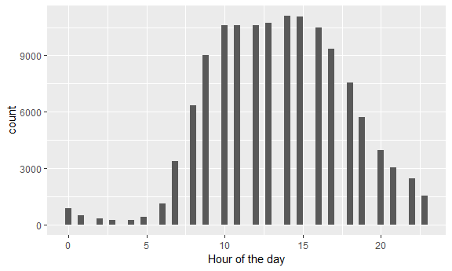

Homework 3
================
Anusorn Thanataveerat
October 3, 2018

true

Problem 1
=========

``` r
data("brfss_smart2010")
health_overall <-
  brfss_smart2010 %>% clean_names() %>%  filter(str_detect(topic, c("Overall Health"))) %>%
  mutate(response = forcats::fct_relevel(response,
  c(
  "Excellent", "Very good", "Good", "Fair", "Poor"
  ))) %>% rename(state = locationabbr,
  county = locationdesc)
```

In 2002, which states were observed at 7 locations?

**Answer**: Florida, Connecticut and North Carolina.

``` r
health_overall %>% filter(year == 2002) %>% distinct(state, county) %>% count(state) %>% 
  filter(n == 7) %>% kable()
```

| state |    n|
|:------|----:|
| CT    |    7|
| FL    |    7|
| NC    |    7|

Make a “spaghetti plot” that shows the number of observations in each state from 2002 to 2010.

``` r
health_overall %>% group_by(year, state) %>% count(state) %>% ggplot(aes(x = year, y = n, group = state)) + geom_line(aes(color = state)) + theme(legend.position = "none") + ylab('Count') + xlab('Year')
```


**Answer**: There are a lot of observations from Florida in 2007 and 2010.

``` r
health_overall %>% group_by(year, state) %>% count(state) %>% ungroup() %>%  top_n(2)
```

    ## Selecting by n

    ## # A tibble: 2 x 3
    ##    year state     n
    ##   <int> <chr> <int>
    ## 1  2007 FL      220
    ## 2  2010 FL      205

Make a table showing, for the years 2002, 2006, and 2010, the mean and standard deviation of the proportion of “Excellent” responses across locations in NY State.

``` r
health_overall %>% filter(year %in% c(2002, 2006, 2010) &
                            state == 'NY' &
                            response == 'Excellent') %>% group_by(year) %>% summarize(mean_excellent = mean(data_value),
                            sd_excellent = sd(data_value)) %>% kable(digits = 1)
```

|  year|  mean\_excellent|  sd\_excellent|
|-----:|----------------:|--------------:|
|  2002|             24.0|            4.5|
|  2006|             22.5|            4.0|
|  2010|             22.7|            3.6|

**Answer**: The average proportion of respondents in New York claiming they are in excellent health is in a decline from year 2002 to 2010.

For each year and state, compute the average proportion in each response category (taking the average across locations in a state).

``` r
# health_overall %>% group_by(year, state, response) %>% summarise(mean_proportion = mean(data_value, na.rm = TRUE)) %>% kable(digits = 2)

health_overall %>% group_by(year, state, response) %>% summarise(mean_proportion = mean(data_value, na.rm = TRUE)) %>% spread(key = response, value = mean_proportion) %>% kable(digits = 2)
```

|  year| state |  Excellent|  Very good|   Good|   Fair|  Poor|
|-----:|:------|----------:|----------:|------:|------:|-----:|
|  2002| AK    |      27.90|      33.70|  23.80|   8.60|  5.90|
|  2002| AL    |      18.50|      30.90|  32.70|  12.10|  5.90|
|  2002| AR    |      24.10|      29.30|  29.90|  12.50|  4.20|
|  2002| AZ    |      24.10|      33.35|  29.40|   8.90|  4.25|
|  2002| CA    |      22.70|      29.80|  28.70|  14.30|  4.50|
|  2002| CO    |      23.07|      32.52|  30.30|  11.22|  2.92|
|  2002| CT    |      29.06|      33.81|  24.97|   8.73|  3.43|
|  2002| DC    |      29.30|      31.80|  28.10|   8.30|  2.40|
|  2002| DE    |      20.90|      34.20|  29.83|  11.07|  4.00|
|  2002| FL    |      25.74|      31.06|  28.94|   9.67|  4.53|
|  2002| GA    |      26.93|      37.30|  26.40|   6.37|  3.00|
|  2002| HI    |      19.57|      36.80|  32.02|   9.00|  2.62|
|  2002| IA    |      28.50|      34.40|  26.80|   7.80|  2.50|
|  2002| ID    |      25.15|      34.00|  28.60|   9.00|  3.25|
|  2002| IL    |      23.20|      36.37|  27.53|  10.03|  2.80|
|  2002| IN    |      19.75|      30.00|  33.40|  12.45|  4.35|
|  2002| KS    |      23.10|      39.07|  27.60|   7.80|  2.43|
|  2002| KY    |      19.80|      30.50|  35.80|   8.50|  5.50|
|  2002| LA    |      24.20|      30.83|  30.23|  10.17|  4.57|
|  2002| MA    |      26.61|      33.44|  25.82|  10.34|  3.80|
|  2002| MD    |      26.40|      35.73|  26.73|   8.65|  2.50|
|  2002| ME    |      23.80|      40.20|  25.05|   9.10|  1.85|
|  2002| MI    |      19.93|      36.42|  30.65|   9.25|  3.73|
|  2002| MN    |      24.15|      42.58|  23.95|   7.00|  2.40|
|  2002| MO    |      22.55|      32.80|  29.15|  11.60|  3.90|
|  2002| MS    |      20.00|      28.80|  32.40|  12.30|  6.70|
|  2002| NC    |      23.56|      34.30|  26.74|  11.11|  4.29|
|  2002| ND    |      20.40|      42.10|  27.60|   6.60|  3.30|
|  2002| NE    |      27.17|      36.50|  26.50|   7.57|  2.27|
|  2002| NH    |      27.36|      37.22|  23.66|   8.98|  2.76|
|  2002| NJ    |      24.82|      31.27|  30.25|  10.53|  3.12|
|  2002| NM    |      23.40|      34.20|  27.60|  11.20|  3.60|
|  2002| NV    |      19.85|      32.40|  31.65|  12.55|  3.50|
|  2002| NY    |      24.04|      30.64|  29.58|  11.62|  4.08|
|  2002| OH    |      19.23|      34.38|  31.02|  11.55|  3.83|
|  2002| OK    |      22.43|      35.00|  28.27|   9.77|  4.57|
|  2002| OR    |      21.30|      36.00|  29.57|  10.57|  2.60|
|  2002| PA    |      22.45|      34.54|  29.58|  10.04|  3.41|
|  2002| RI    |      25.15|      34.58|  28.00|   9.50|  2.77|
|  2002| SC    |      19.60|      27.70|  32.53|  14.63|  5.50|
|  2002| SD    |      23.45|      35.90|  29.25|   8.30|  3.10|
|  2002| TN    |      20.55|      29.80|  33.70|  11.30|  4.75|
|  2002| TX    |      19.25|      26.15|  34.15|  16.30|  4.15|
|  2002| UT    |      29.46|      33.22|  28.04|   6.78|  2.50|
|  2002| VT    |      27.87|      35.77|  25.93|   7.87|  2.60|
|  2002| WA    |      21.73|      35.92|  30.85|   8.90|  2.57|
|  2002| WI    |      21.10|      30.10|  32.70|  12.90|  3.30|
|  2002| WV    |      16.50|      32.40|  33.40|   9.50|  8.30|
|  2002| WY    |      25.50|      35.90|  25.80|   8.70|  4.00|
|  2003| AK    |      24.85|      34.85|  30.60|   6.75|  2.95|
|  2003| AL    |      19.50|      33.40|  30.60|  12.80|  3.70|
|  2003| AR    |      24.30|      32.40|  30.40|  10.10|  2.70|
|  2003| AZ    |      26.30|      33.15|  26.85|  10.55|  3.05|
|  2003| CA    |      22.00|      31.00|  29.30|  12.90|  4.80|
|  2003| CO    |      23.32|      35.45|  25.95|  12.12|  3.15|
|  2003| CT    |      29.18|      34.72|  24.38|   9.32|  2.46|
|  2003| DC    |      27.30|      35.50|  24.70|   9.00|  3.40|
|  2003| DE    |      21.53|      34.67|  28.83|  11.37|  3.63|
|  2003| GA    |      22.03|      35.43|  28.37|   9.40|  4.80|
|  2003| HI    |      23.50|      31.93|  32.40|  10.13|  2.00|
|  2003| IA    |      21.50|      39.70|  30.10|   5.40|  3.40|
|  2003| ID    |      25.90|      37.90|  24.45|   8.80|  3.00|
|  2003| IL    |      23.47|      32.63|  31.27|   9.80|  2.83|
|  2003| IN    |      18.50|      30.65|  32.75|  14.00|  4.10|
|  2003| KS    |      23.33|      39.60|  26.23|   7.83|  2.93|
|  2003| KY    |      23.50|      27.90|  32.60|  11.60|  4.50|
|  2003| LA    |      22.68|      32.30|  29.70|  11.68|  3.68|
|  2003| MA    |      25.34|      33.66|  28.21|   9.60|  3.21|
|  2003| MD    |      24.65|      34.43|  29.00|   8.68|  3.27|
|  2003| ME    |      24.45|      39.50|  26.25|   7.75|  2.10|
|  2003| MI    |      19.40|      34.95|  31.95|   9.55|  4.15|
|  2003| MN    |      24.17|      41.80|  23.30|   9.03|  1.73|
|  2003| MO    |      19.05|      35.95|  31.45|   9.75|  3.85|
|  2003| MS    |      23.40|      32.20|  28.80|  10.90|  4.60|
|  2003| NC    |      25.24|      32.58|  26.66|  12.10|  3.46|
|  2003| ND    |      24.80|      42.70|  24.10|   4.90|  3.40|
|  2003| NE    |      26.13|      38.53|  25.07|   7.57|  2.70|
|  2003| NH    |      28.08|      37.18|  24.08|   7.60|  3.06|
|  2003| NJ    |      23.64|      33.86|  28.12|  10.64|  3.76|
|  2003| NM    |      21.17|      29.20|  33.93|  11.27|  4.43|
|  2003| NV    |      22.75|      31.65|  30.30|  12.50|  2.85|
|  2003| NY    |      21.92|      32.33|  29.52|  12.63|  3.60|
|  2003| OH    |      20.82|      34.00|  29.80|  11.38|  4.03|
|  2003| OK    |      23.60|      31.53|  31.07|  10.33|  3.50|
|  2003| OR    |      24.20|      34.70|  28.00|   9.43|  3.67|
|  2003| PA    |      20.30|      34.50|  28.90|  13.05|  3.25|
|  2003| RI    |      26.65|      35.35|  25.80|   8.65|  3.60|
|  2003| SC    |      27.10|      33.10|  28.58|   7.52|  3.72|
|  2003| SD    |      22.65|      39.80|  26.80|   8.05|  2.70|
|  2003| TN    |      23.80|      33.10|  31.70|   6.70|  4.70|
|  2003| TX    |      20.45|      26.00|  33.85|  14.45|  5.30|
|  2003| UT    |      28.10|      35.70|  26.15|   7.90|  2.17|
|  2003| VT    |      25.97|      37.70|  26.33|   7.57|  2.43|
|  2003| WA    |      20.43|      35.11|  30.13|  10.48|  3.88|
|  2003| WI    |      22.40|      35.20|  26.70|  12.50|  3.20|
|  2003| WV    |      18.20|      35.40|  28.00|  12.00|  6.40|
|  2003| WY    |      22.20|      37.45|  29.40|   7.85|  3.15|
|  2004| AK    |      23.05|      36.80|  29.60|   7.00|  3.25|
|  2004| AL    |      20.00|      30.10|  33.00|  11.20|  5.30|
|  2004| AR    |      21.00|      34.50|  31.20|   9.70|  3.20|
|  2004| AZ    |      22.32|      31.45|  30.00|  11.20|  4.62|
|  2004| CA    |      18.10|      34.00|  29.00|  15.00|  3.50|
|  2004| CO    |      23.37|      34.38|  30.68|   8.62|  2.55|
|  2004| CT    |      26.27|      35.60|  27.27|   7.93|  2.52|
|  2004| DC    |      28.80|      34.00|  25.80|   7.50|  3.30|
|  2004| DE    |      19.43|      36.37|  30.20|  10.07|  3.60|
|  2004| FL    |      21.72|      30.74|  30.84|  11.66|  4.64|
|  2004| IA    |      22.00|      39.10|  27.00|   9.70|  1.80|
|  2004| ID    |      21.20|      36.53|  27.37|   9.63|  4.97|
|  2004| IL    |      24.40|      34.85|  27.25|   9.80|  3.50|
|  2004| IN    |      18.85|      29.50|  32.15|  14.80|  4.30|
|  2004| KS    |      19.52|      38.80|  28.18|   9.47|  3.70|
|  2004| KY    |      21.00|      35.10|  27.50|  12.20|  4.00|
|  2004| LA    |      20.66|      31.64|  29.49|  12.57|  5.27|
|  2004| MA    |      25.59|      35.56|  25.94|   9.36|  3.14|
|  2004| MD    |      25.13|      34.95|  27.83|   8.35|  3.43|
|  2004| ME    |      23.75|      36.90|  25.75|   9.40|  3.80|
|  2004| MI    |      20.07|      31.00|  34.00|  10.87|  3.70|
|  2004| MN    |      23.52|      37.35|  29.57|   7.15|  2.02|
|  2004| MO    |      20.57|      34.13|  29.87|   9.90|  5.07|
|  2004| MS    |      20.30|      32.00|  29.30|  13.00|  5.00|
|  2004| MT    |      20.10|      34.70|  33.00|   7.50|  4.50|
|  2004| NC    |      22.77|      32.12|  28.93|  11.47|  4.37|
|  2004| ND    |      23.80|      38.50|  31.00|   4.00|  2.20|
|  2004| NE    |      22.77|      37.25|  28.00|   8.30|  3.30|
|  2004| NH    |      27.38|      36.18|  25.56|   7.34|  3.18|
|  2004| NJ    |      22.95|      32.31|  29.59|  11.34|  3.32|
|  2004| NM    |      21.48|      30.70|  31.13|  11.63|  4.65|
|  2004| NV    |      20.90|      32.20|  28.90|  14.05|  3.60|
|  2004| NY    |      21.24|      28.70|  31.86|  13.30|  4.54|
|  2004| OH    |      21.05|      35.58|  29.10|  10.36|  3.51|
|  2004| OK    |      20.97|      35.13|  29.10|  10.03|  4.33|
|  2004| OR    |      22.10|      33.83|  31.57|   8.90|  3.30|
|  2004| PA    |      20.93|      33.67|  29.60|  12.00|  3.43|
|  2004| RI    |      24.02|      34.17|  27.73|  10.22|  3.42|
|  2004| SC    |      21.45|      34.02|  30.42|   9.88|  3.75|
|  2004| SD    |      24.85|      38.60|  25.30|   8.50|  2.45|
|  2004| TN    |      19.02|      31.12|  31.38|  11.25|  6.88|
|  2004| TX    |      19.03|      27.85|  32.23|  16.30|  4.15|
|  2004| UT    |      25.50|      35.60|  27.15|   8.83|  2.48|
|  2004| VT    |      23.75|      37.23|  26.30|   9.50|  2.83|
|  2004| WA    |      21.07|      34.45|  31.05|   9.68|  3.34|
|  2004| WI    |      18.70|      33.60|  33.00|  11.10|  3.20|
|  2004| WV    |      18.20|      32.50|  30.00|  15.00|  4.00|
|  2004| WY    |      22.15|      38.60|  27.05|   8.40|  3.40|
|  2005| AK    |      23.85|      33.90|  30.50|   7.35|  4.45|
|  2005| AL    |      16.20|      32.80|  34.30|  11.60|  5.00|
|  2005| AR    |      23.07|      32.70|  28.77|  11.60|  3.87|
|  2005| AZ    |      22.75|      28.25|  32.23|  12.45|  4.40|
|  2005| CA    |      23.50|      29.97|  30.17|  12.72|  3.63|
|  2005| CO    |      25.30|      35.63|  26.42|   9.62|  3.02|
|  2005| CT    |      24.20|      35.93|  27.53|   9.37|  2.97|
|  2005| DC    |      26.40|      34.60|  26.60|   9.10|  3.40|
|  2005| DE    |      20.27|      35.40|  30.20|  10.70|  3.43|
|  2005| FL    |      25.27|      29.90|  28.57|  11.32|  4.95|
|  2005| HI    |      20.90|      31.68|  32.98|  11.35|  3.10|
|  2005| IA    |      21.90|      39.10|  28.40|   8.80|  1.80|
|  2005| ID    |      20.56|      35.08|  30.24|  10.28|  3.84|
|  2005| IL    |      20.17|      35.53|  31.43|  10.30|  2.60|
|  2005| IN    |      20.05|      31.95|  30.05|  13.20|  4.70|
|  2005| KS    |      22.00|      33.80|  30.90|   9.43|  3.88|
|  2005| KY    |      20.00|      32.10|  30.60|  12.10|  5.20|
|  2005| LA    |      16.80|      33.70|  30.20|  15.00|  4.30|
|  2005| MA    |      24.48|      33.20|  28.59|  10.49|  3.31|
|  2005| MD    |      23.39|      36.51|  28.56|   8.30|  3.25|
|  2005| ME    |      24.00|      38.40|  23.70|  10.15|  3.75|
|  2005| MI    |      19.62|      36.07|  30.77|  10.38|  3.17|
|  2005| MN    |      22.45|      41.45|  25.60|   7.95|  2.50|
|  2005| MO    |      17.47|      32.47|  33.43|  13.00|  3.70|
|  2005| MS    |      17.50|      29.70|  33.40|  12.90|  6.50|
|  2005| MT    |      19.10|      35.90|  32.00|   8.50|  4.40|
|  2005| NC    |      20.71|      34.04|  28.91|  11.90|  4.41|
|  2005| ND    |      24.75|      39.30|  28.10|   6.15|  1.75|
|  2005| NE    |      22.17|      37.80|  28.48|   9.07|  2.52|
|  2005| NH    |      24.75|      38.22|  26.45|   7.55|  3.03|
|  2005| NJ    |      21.85|      33.75|  29.04|  11.61|  3.75|
|  2005| NM    |      21.52|      30.55|  32.73|  11.40|  3.80|
|  2005| NV    |      18.70|      33.70|  31.55|  12.65|  3.40|
|  2005| NY    |      21.69|      32.19|  29.69|  12.56|  3.88|
|  2005| OH    |      22.40|      36.17|  27.93|  10.37|  3.13|
|  2005| OK    |      18.34|      31.31|  32.29|  11.69|  6.38|
|  2005| OR    |      19.20|      34.13|  31.23|  11.24|  4.16|
|  2005| PA    |      21.01|      33.76|  31.15|   9.94|  4.11|
|  2005| RI    |      22.58|      37.38|  28.52|   8.55|  2.95|
|  2005| SC    |      21.65|      34.76|  29.16|   9.44|  4.99|
|  2005| SD    |      23.20|      37.90|  28.60|   7.65|  2.65|
|  2005| TN    |      21.65|      33.75|  29.70|  10.75|  4.20|
|  2005| TX    |      21.38|      28.57|  30.15|  15.17|  4.80|
|  2005| UT    |      22.60|      36.96|  27.90|   9.54|  2.94|
|  2005| VT    |      23.93|      38.12|  26.68|   8.78|  2.48|
|  2005| WA    |      19.76|      34.91|  30.49|  10.97|  3.88|
|  2005| WI    |      19.80|      33.90|  31.00|  12.00|  3.30|
|  2005| WV    |      11.50|      30.60|  35.90|  13.00|  9.00|
|  2005| WY    |      20.65|      36.45|  29.55|   9.85|  3.55|
|  2006| AL    |      23.20|      29.50|  29.50|  13.30|  4.40|
|  2006| AR    |      19.60|      34.97|  30.53|  11.47|  3.43|
|  2006| AZ    |      20.93|      30.12|  30.70|  13.43|  3.70|
|  2006| CA    |      21.20|      31.10|  29.74|  13.94|  4.06|
|  2006| CO    |      23.10|      37.82|  28.37|   8.10|  2.57|
|  2006| CT    |      25.87|      35.93|  27.28|   8.63|  2.30|
|  2006| DC    |      27.90|      33.60|  25.50|   9.30|  3.70|
|  2006| DE    |      20.43|      36.17|  30.63|   9.47|  3.33|
|  2006| FL    |      25.50|      29.37|  29.23|  11.86|  4.06|
|  2006| GA    |      25.30|      34.00|  30.40|   7.28|  3.00|
|  2006| HI    |      19.55|      29.30|  35.83|  11.55|  3.77|
|  2006| IA    |      22.80|      38.40|  27.80|   8.00|  3.00|
|  2006| ID    |      20.33|      34.20|  31.13|   9.97|  4.33|
|  2006| IL    |      22.23|      33.63|  29.70|  12.23|  2.23|
|  2006| IN    |      18.85|      30.35|  34.40|  12.35|  4.05|
|  2006| KS    |      19.18|      35.20|  30.90|  11.55|  3.20|
|  2006| KY    |      17.30|      33.80|  29.20|  13.30|  6.40|
|  2006| LA    |      23.24|      31.54|  29.16|  11.10|  4.92|
|  2006| MA    |      24.11|      36.02|  26.65|   9.68|  3.50|
|  2006| MD    |      24.67|      36.82|  26.66|   8.45|  3.37|
|  2006| ME    |      26.55|      35.55|  26.55|   8.80|  2.55|
|  2006| MI    |      18.63|      37.20|  29.63|  10.63|  3.87|
|  2006| MN    |      23.83|      39.50|  26.37|   8.00|  2.30|
|  2006| MO    |      17.60|      37.60|  29.70|  10.80|  4.30|
|  2006| MS    |      21.57|      33.83|  29.77|  10.70|  4.13|
|  2006| MT    |      22.15|      38.50|  26.27|   9.00|  4.08|
|  2006| NC    |      21.82|      32.66|  29.39|  11.47|  4.68|
|  2006| ND    |      24.10|      38.45|  27.40|   8.05|  2.00|
|  2006| NE    |      21.43|      35.80|  29.38|   9.55|  3.85|
|  2006| NH    |      27.40|      37.38|  24.47|   7.42|  3.33|
|  2006| NJ    |      22.70|      33.23|  28.85|  11.40|  3.82|
|  2006| NM    |      23.10|      28.38|  31.74|  11.58|  5.22|
|  2006| NV    |      20.10|      31.10|  31.20|  13.75|  3.85|
|  2006| NY    |      22.53|      31.28|  30.20|  13.07|  2.93|
|  2006| OH    |      21.24|      32.58|  31.02|  11.44|  3.07|
|  2006| OK    |      19.77|      33.17|  29.83|  11.83|  5.43|
|  2006| OR    |      23.85|      35.88|  27.27|   9.75|  3.27|
|  2006| PA    |      18.68|      33.75|  31.17|  11.53|  3.97|
|  2006| RI    |      23.65|      36.73|  27.55|   9.15|  2.88|
|  2006| SC    |      21.24|      35.19|  29.31|  10.09|  4.15|
|  2006| SD    |      20.80|      39.35|  29.55|   7.25|  3.05|
|  2006| TN    |      24.20|      28.20|  30.05|  11.75|  5.80|
|  2006| TX    |      23.70|      29.36|  30.14|  13.14|  3.69|
|  2006| UT    |      25.97|      35.13|  25.65|   9.85|  3.42|
|  2006| VT    |      23.82|      37.82|  27.48|   7.88|  2.98|
|  2006| WA    |      19.21|      33.56|  32.01|  11.79|  3.45|
|  2006| WI    |      18.90|      34.90|  32.60|  10.00|  3.70|
|  2006| WV    |      15.80|      36.60|  26.00|  13.00|  8.60|
|  2006| WY    |      20.10|      37.45|  29.20|   9.80|  3.45|
|  2007| AK    |      23.50|      38.10|  25.70|   7.20|  5.50|
|  2007| AL    |      18.65|      29.35|  29.40|  13.80|  6.65|
|  2007| AR    |      18.83|      35.50|  30.67|  11.03|  3.97|
|  2007| AZ    |      19.08|      29.23|  33.15|  13.02|  4.70|
|  2007| CA    |      24.46|      28.72|  30.56|  12.66|  3.56|
|  2007| CO    |      25.27|      36.88|  26.10|   9.36|  2.40|
|  2007| CT    |      25.13|      38.27|  24.87|   8.95|  2.75|
|  2007| DC    |      26.60|      34.10|  26.20|   9.50|  3.60|
|  2007| DE    |      19.07|      35.50|  31.50|  10.63|  3.33|
|  2007| FL    |      21.39|      30.77|  30.45|  12.07|  5.15|
|  2007| GA    |      24.88|      36.56|  27.94|   7.50|  3.14|
|  2007| HI    |      20.07|      30.57|  33.98|  12.15|  3.23|
|  2007| IA    |      18.00|      38.40|  31.60|   9.70|  2.30|
|  2007| ID    |      21.48|      32.67|  31.02|  11.85|  3.00|
|  2007| IL    |      21.60|      32.97|  31.30|  10.73|  3.37|
|  2007| IN    |      13.30|      36.05|  32.40|  13.35|  4.85|
|  2007| KS    |      19.35|      37.15|  31.02|   9.93|  2.55|
|  2007| KY    |      16.10|      34.30|  31.30|  12.90|  5.30|
|  2007| LA    |      19.60|      33.02|  31.14|  11.40|  4.82|
|  2007| MA    |      26.16|      35.65|  26.16|   9.02|  2.99|
|  2007| MD    |      23.53|      37.14|  26.57|   9.55|  3.24|
|  2007| ME    |      22.80|      36.94|  27.18|   9.76|  3.32|
|  2007| MI    |      17.43|      38.98|  29.18|  10.35|  4.10|
|  2007| MN    |      21.45|      42.60|  24.60|   8.53|  2.77|
|  2007| MO    |      21.23|      33.90|  28.67|  11.83|  4.37|
|  2007| MS    |      18.38|      35.50|  28.20|  12.40|  5.53|
|  2007| MT    |      21.40|      37.90|  26.10|  10.15|  4.45|
|  2007| NC    |      21.17|      31.33|  30.01|  12.05|  5.43|
|  2007| ND    |      21.25|      38.85|  29.95|   7.25|  2.70|
|  2007| NE    |      20.26|      35.50|  31.98|   9.48|  2.78|
|  2007| NH    |      23.44|      38.54|  25.80|   9.28|  2.94|
|  2007| NJ    |      22.29|      35.04|  27.31|  11.22|  4.15|
|  2007| NM    |      19.27|      29.97|  34.32|  12.33|  4.17|
|  2007| NV    |      18.30|      32.90|  32.45|  12.45|  3.90|
|  2007| NY    |      21.11|      34.41|  29.14|  11.56|  3.80|
|  2007| OH    |      18.94|      35.56|  29.69|  12.02|  3.76|
|  2007| OK    |      20.48|      33.30|  31.50|  10.57|  4.10|
|  2007| OR    |      23.40|      35.97|  28.93|   8.80|  2.90|
|  2007| PA    |      20.34|      34.50|  29.76|  11.39|  4.00|
|  2007| RI    |      21.95|      36.67|  26.55|  11.10|  3.70|
|  2007| SC    |      21.28|      36.03|  29.83|   9.15|  3.72|
|  2007| SD    |      23.05|      37.70|  29.00|   8.00|  2.30|
|  2007| TN    |      21.27|      33.48|  26.70|  11.20|  7.33|
|  2007| TX    |      21.70|      28.54|  31.38|  14.00|  4.37|
|  2007| UT    |      25.62|      37.24|  27.32|   7.38|  2.44|
|  2007| VA    |      26.27|      34.38|  28.02|   7.92|  3.42|
|  2007| VT    |      24.42|      38.95|  25.58|   7.90|  3.13|
|  2007| WA    |      20.72|      35.64|  30.14|  10.19|  3.30|
|  2007| WI    |      17.40|      40.70|  28.30|   9.90|  3.60|
|  2007| WV    |      15.70|      37.20|  29.20|  10.30|  7.60|
|  2007| WY    |      19.70|      34.47|  32.60|  10.07|  3.20|
|  2008| AK    |      20.60|      37.40|  29.60|   9.15|  3.20|
|  2008| AL    |      15.85|      30.80|  34.67|  13.68|  4.97|
|  2008| AR    |      19.67|      36.03|  31.23|   9.37|  3.77|
|  2008| AZ    |      18.86|      33.60|  30.60|  12.64|  4.28|
|  2008| CA    |      22.88|      30.32|  30.11|  12.75|  3.95|
|  2008| CO    |      24.49|      36.64|  27.17|   8.77|  2.92|
|  2008| CT    |      26.00|      36.25|  26.07|   8.57|  3.08|
|  2008| DC    |      26.50|      34.80|  24.80|  11.00|  2.80|
|  2008| DE    |      18.43|      36.07|  31.00|  10.67|  3.90|
|  2008| FL    |      27.35|      30.80|  27.12|  10.57|  4.12|
|  2008| GA    |      27.33|      36.67|  24.37|   8.17|  3.50|
|  2008| HI    |      21.18|      29.40|  34.20|  11.43|  3.80|
|  2008| IA    |      19.87|      38.07|  30.13|   9.00|  2.97|
|  2008| ID    |      22.80|      36.23|  26.23|  10.30|  4.40|
|  2008| IL    |      22.60|      36.45|  27.85|  10.95|  2.10|
|  2008| IN    |      17.45|      30.10|  34.95|  12.35|  5.15|
|  2008| KS    |      18.68|      37.02|  30.45|  10.95|  2.90|
|  2008| KY    |      20.40|      33.40|  31.00|  10.80|  4.50|
|  2008| LA    |      22.68|      29.66|  31.64|  11.36|  4.68|
|  2008| MA    |      24.57|      36.59|  26.84|   8.83|  3.19|
|  2008| MD    |      21.67|      37.62|  28.01|   9.71|  3.02|
|  2008| ME    |      21.82|      39.16|  27.74|   7.92|  3.42|
|  2008| MI    |      20.40|      36.75|  29.90|   9.10|  3.88|
|  2008| MN    |      23.32|      41.25|  25.75|   7.30|  2.38|
|  2008| MO    |      18.27|      34.47|  31.07|  11.47|  4.73|
|  2008| MS    |      20.00|      31.55|  34.50|  10.00|  4.00|
|  2008| MT    |      21.80|      35.47|  29.67|   9.50|  3.50|
|  2008| NC    |      21.66|      33.72|  29.21|  11.47|  3.93|
|  2008| ND    |      20.50|      38.57|  29.70|   8.43|  2.80|
|  2008| NE    |      19.30|      35.65|  32.04|   9.70|  3.31|
|  2008| NH    |      22.93|      38.77|  26.20|   8.88|  3.27|
|  2008| NJ    |      23.87|      32.68|  28.86|  10.95|  3.64|
|  2008| NM    |      20.58|      29.38|  33.00|  11.54|  5.48|
|  2008| NV    |      19.00|      30.35|  32.90|  13.60|  4.20|
|  2008| NY    |      22.79|      33.23|  29.60|  10.82|  3.52|
|  2008| OH    |      19.82|      36.02|  29.61|  10.86|  3.65|
|  2008| OK    |      20.53|      31.67|  31.53|  11.27|  4.97|
|  2008| OR    |      24.73|      37.13|  26.93|   8.50|  2.70|
|  2008| PA    |      19.57|      32.61|  30.85|  12.62|  4.30|
|  2008| RI    |      24.18|      38.36|  25.68|   9.36|  2.38|
|  2008| SC    |      21.49|      33.00|  31.06|   9.60|  4.97|
|  2008| SD    |      21.35|      40.80|  27.70|   7.25|  2.90|
|  2008| TN    |      22.70|      28.55|  32.30|  11.30|  5.15|
|  2008| TX    |      20.72|      29.87|  31.69|  12.96|  4.74|
|  2008| UT    |      26.92|      34.52|  27.72|   8.22|  2.62|
|  2008| VT    |      23.58|      38.68|  25.85|   9.15|  2.72|
|  2008| WA    |      20.46|      34.92|  29.64|  11.40|  3.58|
|  2008| WI    |      22.50|      34.20|  25.70|  13.70|  3.90|
|  2008| WV    |      17.80|      26.60|  30.40|  17.60|  7.70|
|  2008| WY    |      19.30|      35.36|  31.64|   9.74|  3.94|
|  2009| AK    |      23.20|      40.00|  28.20|   6.20|  2.40|
|  2009| AL    |      21.60|      29.75|  30.20|  13.75|  4.75|
|  2009| AR    |      23.33|      36.53|  24.93|  11.60|  3.63|
|  2009| AZ    |      21.97|      31.80|  31.27|  10.70|  4.33|
|  2009| CA    |      24.13|      31.06|  27.47|  13.36|  3.97|
|  2009| CO    |      24.65|      38.46|  25.94|   8.49|  2.45|
|  2009| CT    |      25.64|      38.10|  26.18|   7.58|  2.50|
|  2009| DC    |      28.00|      35.10|  24.80|   8.90|  3.10|
|  2009| DE    |      19.27|      37.87|  28.73|  11.13|  2.93|
|  2009| FL    |      22.57|      32.71|  29.84|  11.12|  3.76|
|  2009| GA    |      22.80|      35.48|  29.40|   9.80|  2.48|
|  2009| HI    |      20.60|      29.20|  35.92|  11.15|  3.08|
|  2009| IA    |      20.33|      39.03|  31.00|   7.70|  2.00|
|  2009| ID    |      20.10|      34.62|  30.20|  11.90|  3.20|
|  2009| IL    |      22.45|      36.75|  28.90|   8.90|  2.92|
|  2009| IN    |      17.77|      30.95|  33.00|  14.32|  3.98|
|  2009| KS    |      21.69|      37.83|  29.16|   8.50|  2.83|
|  2009| KY    |      18.00|      30.70|  32.10|  10.70|  8.40|
|  2009| LA    |      18.79|      33.00|  29.04|  14.15|  5.00|
|  2009| MA    |      26.28|      35.30|  26.21|   9.41|  2.80|
|  2009| MD    |      22.51|      36.59|  28.73|   8.66|  3.49|
|  2009| ME    |      23.06|      37.14|  28.00|   9.04|  2.76|
|  2009| MI    |      17.52|      39.00|  29.15|  10.65|  3.68|
|  2009| MN    |      24.88|      40.15|  25.55|   7.15|  2.30|
|  2009| MO    |      20.43|      36.37|  28.47|  11.00|  3.70|
|  2009| MS    |      16.46|      32.01|  31.07|  14.26|  6.20|
|  2009| MT    |      21.27|      34.90|  28.90|  11.25|  3.68|
|  2009| NC    |      20.69|      33.07|  30.93|  11.17|  4.13|
|  2009| ND    |      20.40|      40.50|  29.17|   7.27|  2.67|
|  2009| NE    |      18.60|      36.43|  31.24|  10.54|  3.22|
|  2009| NH    |      24.30|      37.26|  27.14|   8.76|  2.60|
|  2009| NJ    |      24.74|      33.64|  28.06|  10.37|  3.19|
|  2009| NM    |      21.01|      29.27|  33.69|  12.03|  3.97|
|  2009| NV    |      20.05|      35.55|  29.75|  10.75|  3.95|
|  2009| NY    |      23.32|      33.27|  30.20|   9.94|  3.27|
|  2009| OH    |      19.89|      33.17|  30.52|  12.22|  4.17|
|  2009| OK    |      20.70|      34.33|  29.85|  10.68|  4.50|
|  2009| OR    |      22.30|      42.10|  24.93|   8.10|  2.57|
|  2009| PA    |      18.07|      34.86|  30.89|  12.68|  3.49|
|  2009| RI    |      23.75|      37.27|  27.55|   8.28|  3.10|
|  2009| SC    |      20.93|      35.41|  29.90|   9.11|  4.66|
|  2009| SD    |      19.75|      38.00|  30.75|   9.45|  2.10|
|  2009| TN    |      22.52|      32.77|  27.35|  10.85|  6.52|
|  2009| TX    |      21.12|      32.12|  32.31|  11.29|  3.19|
|  2009| UT    |      26.46|      35.73|  27.91|   7.59|  2.33|
|  2009| VT    |      23.50|      37.47|  28.07|   8.47|  2.50|
|  2009| WA    |      20.72|      34.23|  30.65|  10.86|  3.48|
|  2009| WI    |      20.00|      33.10|  32.80|  10.30|  3.80|
|  2009| WV    |      13.40|      32.10|  28.80|  17.70|  8.10|
|  2009| WY    |      20.93|      37.10|  27.80|   9.70|  4.43|
|  2010| AL    |      18.43|      30.27|  32.70|  13.23|  5.37|
|  2010| AR    |      25.40|      32.73|  30.30|   8.50|  3.07|
|  2010| AZ    |      21.60|      33.00|  30.97|  10.00|  4.40|
|  2010| CA    |      23.88|      33.40|  26.82|  12.28|  3.64|
|  2010| CO    |      25.39|      39.14|  25.46|   7.69|  2.30|
|  2010| CT    |      24.24|      37.18|  27.32|   9.14|  2.08|
|  2010| DC    |      26.10|      36.90|  26.50|   8.20|  2.40|
|  2010| DE    |      20.30|      35.13|  30.17|  10.97|  3.50|
|  2010| FL    |      19.57|      32.51|  29.66|  12.61|  5.19|
|  2010| GA    |      23.10|      39.12|  27.02|   7.90|  2.90|
|  2010| HI    |      20.18|      30.85|  34.45|  11.10|  3.45|
|  2010| IA    |      21.90|      35.35|  33.55|   7.25|  1.95|
|  2010| ID    |      19.80|      36.38|  28.53|  10.73|  4.55|
|  2010| IL    |      21.35|      36.30|  28.65|  10.10|  3.65|
|  2010| IN    |      17.10|      31.30|  33.47|  12.13|  6.03|
|  2010| KS    |      19.23|      36.98|  29.00|  11.55|  3.25|
|  2010| KY    |      16.30|      34.30|  31.20|  11.60|  6.50|
|  2010| LA    |      18.36|      31.86|  30.16|  15.12|  4.44|
|  2010| MA    |      26.79|      36.02|  26.18|   7.91|  3.10|
|  2010| MD    |      22.20|      35.48|  29.71|   9.45|  3.18|
|  2010| ME    |      23.38|      36.78|  26.13|  10.17|  3.53|
|  2010| MI    |      19.88|      37.67|  29.80|   8.90|  3.75|
|  2010| MN    |      25.44|      38.72|  26.04|   7.42|  2.36|
|  2010| MO    |      17.53|      35.23|  32.03|  10.80|  4.37|
|  2010| MS    |      18.65|      27.50|  31.65|  16.15|  6.05|
|  2010| MT    |      20.63|      36.47|  29.47|   9.63|  3.80|
|  2010| NC    |      21.88|      34.42|  29.01|  10.43|  4.29|
|  2010| ND    |      20.03|      38.43|  29.67|   9.70|  2.13|
|  2010| NE    |      19.51|      35.61|  31.55|   9.79|  3.55|
|  2010| NH    |      21.88|      40.36|  27.00|   7.68|  3.14|
|  2010| NJ    |      24.07|      34.10|  28.13|  10.14|  3.55|
|  2010| NM    |      22.30|      29.10|  30.92|  12.97|  4.77|
|  2010| NV    |      21.30|      33.25|  29.10|  11.10|  5.30|
|  2010| NY    |      22.70|      34.13|  28.81|  10.97|  3.39|
|  2010| OH    |      18.90|      34.76|  30.86|  11.54|  3.95|
|  2010| OK    |      19.83|      33.23|  29.57|  11.50|  5.90|
|  2010| OR    |      20.65|      38.80|  26.38|   9.65|  4.50|
|  2010| PA    |      21.04|      33.86|  29.81|  11.00|  4.26|
|  2010| RI    |      24.42|      37.82|  27.36|   7.88|  2.54|
|  2010| SC    |      19.51|      36.07|  29.36|  10.90|  4.47|
|  2010| SD    |      18.10|      42.30|  30.35|   7.20|  2.05|
|  2010| TN    |      17.50|      34.84|  30.50|  11.32|  5.86|
|  2010| TX    |      19.52|      29.91|  32.99|  12.13|  5.24|
|  2010| UT    |      27.77|      32.98|  28.72|   7.47|  3.07|
|  2010| VT    |      23.53|      39.50|  26.15|   7.63|  3.15|
|  2010| WA    |      19.72|      34.89|  31.10|  10.73|  3.57|
|  2010| WI    |      21.50|      32.30|  28.50|  13.90|  3.80|
|  2010| WV    |      16.80|      27.10|  33.80|  15.00|  7.40|
|  2010| WY    |      20.95|      33.45|  30.90|  10.40|  4.25|

Make a five-panel plot that shows, for each response category separately, the distribution of these state-level averages over time.

``` r
health_overall %>% group_by(year, state, response) %>% summarise(mean_proportion = mean(data_value, na.rm = TRUE)) %>% ggplot(aes(x = year, y = mean_proportion, color = state)) + geom_line() + 
  facet_wrap(. ~ response) + theme(legend.position = "none")
```



**Answer**: The majority of respondents give themselves a very good health and it has been consistent across the years and those rated themselves with poor health are the minority in every state and throughout the years 2002 to 2010.

Problem 2
=========

**Answer**: The original dataset consists of 1384617 observations and 15 variables with details on the items customers buy on instacart website, including the time of the purchase and the duration from the last purchase at the store. The data is gathered from 131209 unique customers and the type of products with the highest purchase volume is produce (29.55% of the total volume). Among the produce category, here are the top 5 best selling items.

``` r
instacart %>% filter(department == 'produce') %>% count(product_name) %>% top_n(5) %>% kable()
```

    ## Selecting by n

| product\_name          |      n|
|:-----------------------|------:|
| Bag of Organic Bananas |  15480|
| Banana                 |  18726|
| Large Lemon            |   8135|
| Organic Baby Spinach   |   9784|
| Organic Strawberries   |  10894|

The average number of items in each purchase is 10.6. We further look into what time of day customers usually place their order. And surprisingly, the orders mostly come in during 10am to 3pm, so people spend their working hours on buying groceries online!

``` r
instacart %>% group_by(order_id) %>% count(order_hour_of_day) %>% ggplot(aes(order_hour_of_day)) + geom_histogram(binwidth = 0.4) + xlab('Hour of the day')
```


How many aisles are there, and which aisles are the most items ordered from?

**Answer**: There are 134 aisles and with aisle 83 having 150609 items ordered from. ps. Aisle 83 is fresh vegetables so it makes sense that people would buy from this aise the most often given the short shelf life.

Make a plot that shows the number of items ordered in each aisle. Order aisles sensibly, and organize your plot so others can read it.

``` r
plot1 <-
  instacart %>% filter(aisle_id < 70) %>%  ggplot(aes(aisle_id)) + geom_histogram(binwidth = 0.9) + coord_flip() + xlab('Aisle ID') + scale_x_continuous(breaks =
  seq(0, 69, 5))
  plot2 <-
  instacart %>% filter(aisle_id >= 70) %>%  ggplot(aes(aisle_id)) + geom_histogram(binwidth = 0.9) + coord_flip() + xlab('') + scale_x_continuous(breaks =
  seq(70, 134, 5))
  plot1 + plot2
```


**Answer**: From the plot, we can see there are 4 aisles with the item counts exceed 50,000 units.(see table below). Again, these perishables have short shelf life and require more frequent re-orderings.

``` r
instacart %>% count(aisle) %>% filter(n > 50000) %>% kable()
```

| aisle                      |       n|
|:---------------------------|-------:|
| fresh fruits               |  150473|
| fresh vegetables           |  150609|
| packaged vegetables fruits |   78493|
| yogurt                     |   55240|

Make a table showing the most popular item aisles “baking ingredients”, “dog food care”, and “packaged vegetables fruits”

``` r
instacart %>% filter(aisle %in% c("baking ingredients", "dog food care", "packaged vegetables fruits")) %>% group_by(aisle) %>%  count(product_name) %>% top_n(1) %>% kable()
```

    ## Selecting by n

| aisle                      | product\_name                                 |     n|
|:---------------------------|:----------------------------------------------|-----:|
| baking ingredients         | Light Brown Sugar                             |   499|
| dog food care              | Snack Sticks Chicken & Rice Recipe Dog Treats |    30|
| packaged vegetables fruits | Organic Baby Spinach                          |  9784|

Make a table showing the mean hour of the day at which Pink Lady Apples and Coffee Ice Cream are ordered on each day of the week; format this table for human readers (i.e. produce a 2 x 7 table).

``` r
instacart %>% filter(product_name %in% c('Pink Lady Apples', 'Coffee Ice Cream')) %>% group_by(product_name, order_dow) %>% summarise(mean_hour = round(mean(order_hour_of_day),1)) %>% spread(key = order_dow, value = mean_hour) %>% kable() 
```

| product\_name    |     0|     1|     2|     3|     4|     5|     6|
|:-----------------|-----:|-----:|-----:|-----:|-----:|-----:|-----:|
| Coffee Ice Cream |  13.8|  14.3|  15.4|  15.3|  15.2|  12.3|  13.8|
| Pink Lady Apples |  13.4|  11.4|  11.7|  14.2|  11.6|  12.8|  11.9|

**Answer** On most days of the week, people tend to purchase pink lady apples around noon while the coffee ice cream is usually ordered a little later, around early afternoon. ps. I was trying to find what each number of the variable 'order\_dow' represents what day but couldn't find credible data dictionary (see link attached) <https://gist.github.com/jeremystan/c3b39d947d9b88b3ccff3147dbcf6c6b>

Problem 3
=========

This problem uses the NY NOAA data. DO NOT include this dataset in your local data directory; instead, load the data from the p8105.datasets package (it’s called ny\_noaa).

**Answer**: This is the weather data, with 2595176 observations, which consists of daily information on precipition, snow and temperature from various locations. It's in a long format and hasn't been tidied since there are rows with no information on the weather. Thus we removed those observations with no data (72278 rows) and ended up with the final dataset with 2522898 observations. The data comes from 747 unique weather stations in NY from year 1981 to 2010. There are a lot of missing data observed in the dataset particularly the tmax and tmin (42%). Another variable with dubious input is snow given there is one record, dated 2005-06-15, that shows the amount of snow in negative (-0.511811).

For snowfall, what are the most commonly observed values? Why?

**Answer**: It's 0 since snow doesn't fall all year round, just during the winter season.

Make a two-panel plot showing the average temperature in January and in July in each station across years. Is there any observable / interpretable structure? Any outliers?

``` r
cleaned_dat %>% group_by(month, year, id) %>% summarise(tmax_avg = mean(tmax, na.rm = TRUE),
  tmin_avg = mean(tmin, na.rm = TRUE)) %>% filter(month %in% c(1, 7)) %>% mutate(month_name = month.name[month]) %>% gather(key = max_min, value = temp, tmax_avg:tmin_avg) %>% ggplot(aes(x = year, y = temp, color = max_min)) + geom_jitter() +  facet_grid(. ~ month_name) + ylab('Temperature') + xlab('Year') + scale_color_manual(
  name = "",
  labels = c("Average Max",
  "Average Min"),
  values = c('tmax_avg' = 'red', 'tmin_avg' = 'blue')
  )
```


Make a two-panel plot showing (i) tmax vs tmin for the full dataset (note that a scatterplot may not be the best option); and (ii) make a plot showing the distribution of snowfall values greater than 0 and less than 100 separately by year.

``` r
plot_a <- cleaned_dat %>% filter(!is.na(tmax) & !is.na(tmin)) %>% gather(key = max_min, value = temp, tmax:tmin) %>% ggplot(aes(x = date, y = temp, color = max_min)) + geom_smooth() + ylab('Temperature') + xlab('Date') + ggtitle('Daily Max and Min temperature (F)') + scale_color_manual(
  name = "",
  labels = c("Max temp.",
  "Min temp."),
  values = c('tmax' = 'red', 'tmin' = 'blue')
  )
plot_b <- cleaned_dat %>% filter(snow > 0 & snow < 100/25.4) %>% ggplot(aes(x = snow, fill = as.character(year))) +
  geom_density(alpha = .15, show.legend = FALSE) + 
  viridis::scale_fill_viridis(discrete = TRUE) + labs(x = 'Snow (in inches)', y = 'Density', title = 'Distribution of snowfall values greater than 0 and less than 4 inches by year') + theme_light()
#Create plot
plot_a + plot_b + plot_layout(ncol = 1, heights = c(1, 2))
```

    ## `geom_smooth()` using method = 'gam' and formula 'y ~ s(x, bs = "cs")'


